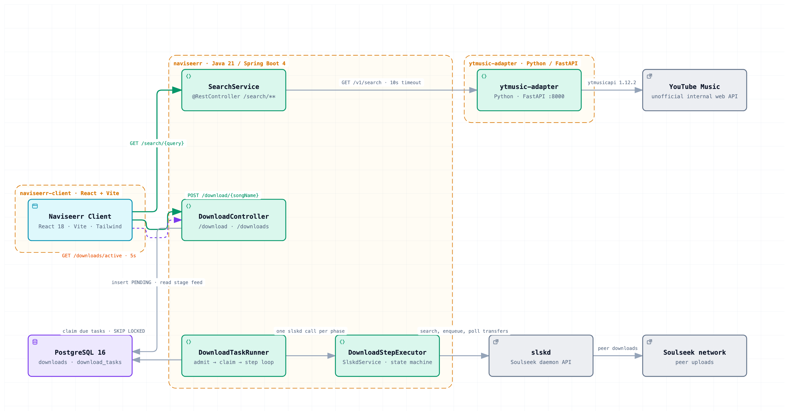
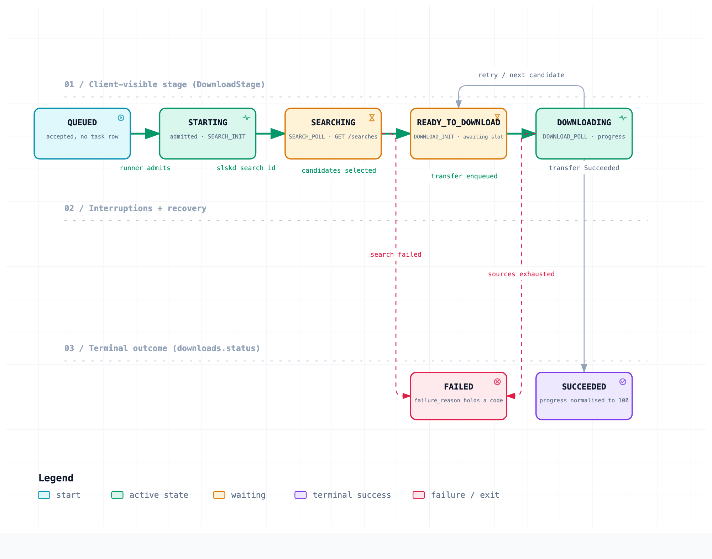

The aim of this project is to provide a service that can be used to search tracks, artists and albums and download them using free sources such as the soulseek network (slskd), torrent indexers and any other solutions possible.

This is only the backend or server, for a visual experience this needs to be paired with a client.

## Architecture

<picture>
  <source media="(prefers-color-scheme: dark)" srcset="docs/architecture/diagrams/system-architecture-dark.png">
  
</picture>

Three repositories, one stack: this one, [`naviseerr-client`](https://github.com/catacomb5099/naviseerr-client)
(React 18 + Vite), and [`ytmusic-adapter`](https://github.com/catacomb5099/ytmusic-adapter)
(a FastAPI sidecar over `ytmusicapi`). The client reaches search and downloads the same way —
plain REST against two controllers. Nothing streams; the client polls `/downloads/active`.

The diagram above is a static export. The **interactive** version — pan and zoom, click any
component to trace its relationships, plus guided walkthroughs of the search path, the
download-initiation path and the download lifecycle — is one self-contained HTML file:
[`docs/architecture/diagrams/system-architecture.html`](docs/architecture/diagrams/system-architecture.html).

GitHub serves `.html` as source rather than rendering it, so open it one of these ways:

- **[Open the interactive diagram](https://raw.githack.com/catacomb5099/naviseerr/master/docs/architecture/diagrams/system-architecture.html)** (via raw.githack.com)
- `git clone` and open the file in any browser — it has no dependencies and needs no server

### Download lifecycle

<picture>
  <source media="(prefers-color-scheme: dark)" srcset="docs/architecture/diagrams/download-lifecycle-dark.png">
  
</picture>

`DownloadStage` is the only vocabulary on the wire — `ActiveDownloadRepository.toStage` is the
single place `downloads.status` and `download_tasks.phase` are combined. `PENDING` renders as
`QUEUED`; `IN_PROGRESS` covers all four `DownloadPhase` steps. A failed transfer returns to
`DOWNLOAD_INIT` with progress reset, and only gives up once retries and candidates are spent.

[Open the interactive lifecycle diagram](https://raw.githack.com/catacomb5099/naviseerr/master/docs/architecture/diagrams/download-lifecycle.html)

## Local setup

Copy `.env.example` to `.env` and fill in `SLSKD_API_KEY` (required; the app fails fast at startup
without it). `LASTFM_API_KEY` is no longer needed — search runs through YouTube Music and nothing calls
Last.fm, so it has a placeholder default. `.env` is gitignored and loaded automatically by Spring — see
`spring.config.import` in [application.yaml](src/main/resources/application.yaml).

## ytmusic-adapter

`compose.yaml` includes a `ytmusic-adapter` service (a Python/FastAPI adapter around
`ytmusicapi`) via `build: ../ytmusic-adapter`. That relative path means `./gradlew bootRun`
(which auto-starts compose through `spring-boot-docker-compose`) only starts that service
successfully if the sibling repo `../ytmusic-adapter` is checked out next to this one. It backs
search (`GET /search/**`) via `YtMusicService` — see
[docs/architecture/ytmusic-integration.md](docs/architecture/ytmusic-integration.md), and that
repo's own README for its API surface.

## Inspiration
This project is largely inspired by the seerr app that allows the searching and downloading of movies and tv shows through other apps like Radarr and Sonarr. While existing PRs to enable music support exist, they seem to be based on lidarr or listenbrainz which have limitations. Notably, incomplete data sources that do not include less popular tracks like say "M Huncho : Crazy Titch", and a focus on artist and albums as opposed to individual tracks.

