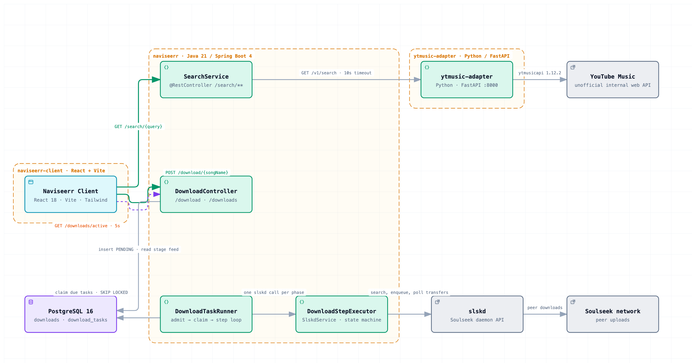
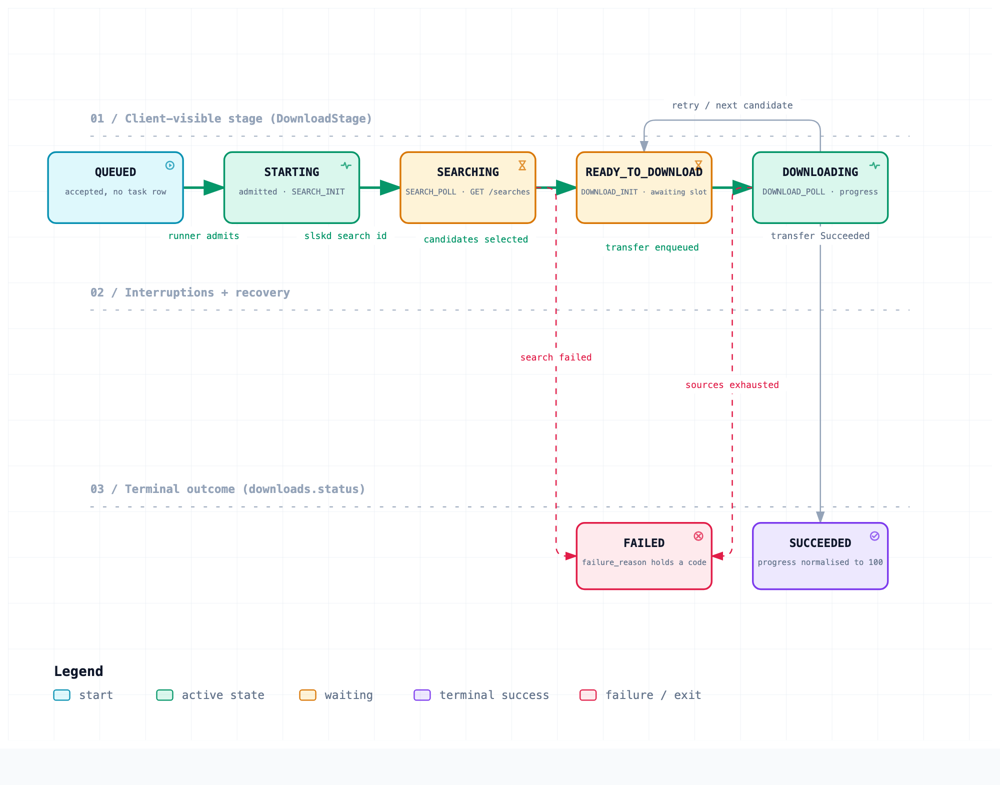

The aim of this project is to provide a service that can be used to search tracks, artists and albums and download them using free sources such as the soulseek network (slskd), torrent indexers and any other solutions possible.

This repository is the server. The web app lives in [naviseerr-client](https://github.com/catacomb5099/naviseerr-client); the install below includes both.

## Install

This section is for running naviseerr at home, not for working on its code. One command starts
everything: the naviseerr server, its web app, its own Soulseek client
([slskd](https://github.com/slskd/slskd); Soulseek is the file-sharing network naviseerr downloads
from), a database, and the helper that searches YouTube Music. Every song and playlist you download
lands in one music folder, ready for [Navidrome](https://www.navidrome.org/) or
[Jellyfin](https://jellyfin.org/) to play.

### What you need

- A computer that stays switched on: a home server, a NAS or a spare PC.
- Docker, which runs each part in its own sealed box (a "container"):
  [install Docker](https://docs.docker.com/get-started/get-docker/). Docker Desktop on Windows and macOS,
  Docker Engine on Linux. Both include `docker compose` (version 2.24 or newer). On Linux, run the
  `docker` commands below with `sudo`, or first
  [add yourself to the `docker` group](https://docs.docker.com/engine/install/linux-postinstall/).
- `git`, to download this project.
- About 4 GB of free disk space for naviseerr itself (the first start downloads at least 700 MB), plus
  room for your music, and about 600 MB of free memory.

### Steps

1. Download naviseerr and go into its folder. `-b move-fast-break-things` picks the branch with the
   newest version:
   ```sh
   git clone -b move-fast-break-things https://github.com/catacomb5099/naviseerr.git
   cd naviseerr
   ```
2. Say where your music goes. Make the settings file and fill in `LIBRARY_DIR=` in a text editor with
   the folder your music library lives in, for example `/srv/music` or `/Volumes/NAS/Music`:
   ```sh
   cp .env.example .env
   ```
   The folder must already exist: naviseerr never invents one for you, so a mistyped path stops the
   start instead of quietly filling a new empty folder on the wrong disk. `LIBRARY_DIR=./library`
   keeps the old default, a `library/` folder inside this one (`mkdir library` first). Everything else
   is optional and made up or defaulted when left empty, including the Soulseek username
   (`naviseerr-xxxxxx`) and its password. A name of your own (`SOULSEEK_USERNAME=`) is friendlier on
   the network than a generated one: the account is created the first time naviseerr logs in, so pick
   one nobody else is likely to have (1 to 30 characters, no accents or emoji). `SHARE_LIBRARY`: your
   music folder is shared on Soulseek unless you set it to `false`. If you change `SHARE_LIBRARY`
   after the first start, run `docker compose up -d` and then `docker compose restart slskd`: until
   that restart, slskd keeps sharing what it shared before.
3. Start it:
   ```sh
   docker compose up -d
   ```
   The first start builds everything from source and takes several minutes. Later starts take seconds.
   `docker compose ps` shows what is running.
4. Save your Soulseek account. The first start prints the username and the password once:
   ```sh
   docker compose logs setup
   ```
   Later runs print the username only; both are in `docker compose exec slskd cat /app/slskd.yml` (the
   `username:` and `password:` under `soulseek:`). Keep them somewhere safe: **Soulseek passwords
   cannot be reset.**
5. Open the web app at `http://<this computer's address>:5056`, or http://localhost:5056 on the same
   computer. Is it working? `docker compose ps` shows every part running, the web app has no amber
   "Not connected to Soulseek" strip across its top (it stays until the Soulseek login works), and
   `docker compose logs slskd` does not keep saying "Failed to reconnect" (slskd cannot reach
   Soulseek) or "invalid username or password" (see Troubleshooting).
6. Point your music app at the music folder (`LIBRARY_DIR`). If your music app runs in Docker too, give
   its container the same folder.
   - **Navidrome:** its music folder must be `LIBRARY_DIR` or a folder that contains it. Playlists are
     imported by themselves. They belong to the first admin account. Admin accounts see them; other
     accounts only if you start Navidrome with `ND_DEFAULTPLAYLISTPUBLICVISIBILITY=true`.
   - **Jellyfin:** add `LIBRARY_DIR` to a library of type Music. Playlists appear for everyone who can
     see that library. Tested with Jellyfin 12.1.0. If a playlist shows up empty on your version, see
     [issue #18169](https://github.com/jellyfin/jellyfin/issues/18169).
7. Optional, but you get more search results and fewer failed downloads: on your router's "port
   forwarding" page, forward TCP port 50300 to this computer. That is the door other Soulseek users
   knock on; slskd cannot open it by itself. **Do not forward port 5056 on your router: the web app
   has no login.**

### Updating

```sh
git pull && docker compose up -d --build
```

Keep the `--build`: `docker compose up -d` on its own only restarts what you already have and never
rebuilds the YouTube Music helper (`ytmusic-adapter`), so an update that needs a newer helper, such as
the pictures of similar artists, quietly stays off. The server then prints a warning, see Troubleshooting.

**Updating from before 09-10-2026, when the music folder had a default:** `LIBRARY_DIR` is now
required. If you never set it, add `LIBRARY_DIR=./library` to `.env` (the folder the old default
used, inside this one) before `docker compose up`; until then every `docker compose` command,
`stop` and `logs` included, stops with "required variable LIBRARY_DIR is missing a value".

### Stopping, removing and backing up

- **Stop:** `docker compose stop`, or `docker compose down`, which also removes the containers. Both
  keep your settings, passwords, download history and music; `docker compose up -d` starts it again.
- **Remove everything:** `docker compose down -v`. **This deletes your generated Soulseek username
  and password for good, and your download history. Soulseek passwords cannot be reset: without a
  copy, that Soulseek account is lost.** Back up first. Your music folder (`LIBRARY_DIR`) is an ordinary folder
  and stays; delete it yourself if you want it gone.
- **Back up** while naviseerr is running or stopped with `docker compose stop` (after
  `docker compose down`, run `docker compose up -d` first: the command below needs its containers):
  - The generated username and passwords, the part of naviseerr's config that cannot be made again:
    ```sh
    docker compose cp setup:/config/secrets.env ./naviseerr-secrets.env
    ```
    Move `naviseerr-secrets.env` somewhere safe. To use the same Soulseek account on a new install,
    copy its `SOULSEEK_USERNAME=` and `SOULSEEK_PASSWORD=` lines into `.env`.
  - Your music: copy `LIBRARY_DIR` like any other folder, or add it to the backups you already make.

### Troubleshooting

- **"required variable LIBRARY_DIR is missing a value".** `.env` has no `LIBRARY_DIR` (or an empty
  one). Add `LIBRARY_DIR=/path/to/your/music` (see step 2); `LIBRARY_DIR=./library` is the old
  default. Nothing runs, not even `docker compose stop`, until it is set.
- **"bind source path does not exist: /some/path".** `LIBRARY_DIR` points at a folder that is not
  there, a typo most often. Fix the path in `.env`, or create the folder (`mkdir -p /some/path`), then
  `docker compose up -d`. naviseerr never creates it for you, so a wrong path cannot quietly become a
  new empty library on the wrong disk.
- **Nothing starts.** `docker compose logs setup` says what is wrong, for example a
  `SOULSEEK_USERNAME` in `.env` that breaks Soulseek's rules (leave it empty and a name is made up
  for you).
- **"Username taken".** The web app keeps its "Not connected to Soulseek" strip, and
  `docker compose logs slskd` says "invalid username or password": someone
  else already has that name. Choose another `SOULSEEK_USERNAME` in `.env`, run `docker compose up -d`,
  then `docker compose restart slskd` (slskd tries to log in once and then waits). The strip goes
  within about 30 seconds of the login working, or reload the page.
- **Linux: permission errors** ("permission denied", "Could not file song"). Every container runs as
  one user, `PUID`:`PGID` in `.env` (default 1000:1000). They must be allowed to write into
  `LIBRARY_DIR`: set them to the folder's owner (`ls -ln` shows its numbers; `id -u` and `id -g` show
  yours), then run `docker compose up -d`.
- **Similar artists have no pictures** (grey circles with names on an artist page), and
  `docker compose logs naviseerr` says "similar artists arrived without a picture ... ytmusic-adapter
  is probably out of date". The YouTube Music helper is an old build: run `docker compose up -d --build`.
- **Playlists missing.** Check, in order:
  1. The playlist download finished with at least one song: the playlist file is written once one of
     its songs is in the library.
  2. The file is there: `LIBRARY_DIR/Playlists/<playlist name>.m3u8`.
  3. Your music app's library covers the whole `LIBRARY_DIR` (not just one artist folder) and has
     scanned since.
  4. Navidrome: you are logged in as an admin, or `ND_DEFAULTPLAYLISTPUBLICVISIBILITY=true`.
  5. Jellyfin: the library type is Music (and see issue #18169 if a playlist is there but empty).
  6. Playlists downloaded before this install are not added afterwards.

## [Architecture](https://raw.githack.com/catacomb5099/naviseerr/master/docs/architecture/diagrams/system-architecture.html)

<picture>
  <source media="(prefers-color-scheme: dark)" srcset="docs/architecture/diagrams/system-architecture-dark.png">
  
</picture>

Three repositories, one stack: this one, [`naviseerr-client`](https://github.com/catacomb5099/naviseerr-client)
(React 18 + Vite), and [`ytmusic-adapter`](https://github.com/catacomb5099/ytmusicapi)
(a FastAPI sidecar over `ytmusicapi`). The client reaches search and downloads the same way —
plain REST against the search, collection and download controllers. Nothing streams; the client polls `/downloads/active`.

The diagram above is a static export. The **interactive** version — pan and zoom, click any
component to trace its relationships, plus guided walkthroughs of the search path, the
download-initiation path and the download lifecycle — is one self-contained HTML file:
[`docs/architecture/diagrams/system-architecture.html`](docs/architecture/diagrams/system-architecture.html).

GitHub serves `.html` as source rather than rendering it, so open it one of these ways:

- **[Open the interactive diagram](https://raw.githack.com/catacomb5099/naviseerr/master/docs/architecture/diagrams/system-architecture.html)** (via raw.githack.com)
- `git clone` and open the file in any browser — it has no dependencies and needs no server

### Download lifecycle

<picture>
  <source media="(prefers-color-scheme: dark)" srcset="docs/architecture/diagrams/download-lifecycle-dark.png">
  
</picture>

`DownloadStage` is the only vocabulary on the wire — `ActiveDownloadRepository.toStage` is the
single place `downloads.status` and `download_tasks.phase` are combined. `PENDING` renders as
`QUEUED`; `IN_PROGRESS` covers all four `DownloadPhase` steps. A failed transfer returns to
`DOWNLOAD_INIT` with progress reset, and only gives up once retries and candidates are spent.

[Open the interactive lifecycle diagram](https://raw.githack.com/catacomb5099/naviseerr/master/docs/architecture/diagrams/download-lifecycle.html)

## Development

For working on the server itself: run `NaviseerrApplication` from IntelliJ or `./gradlew bootRun`
(Java 21). Either one starts [compose.dev.yaml](compose.dev.yaml) by itself (Postgres and the
ytmusic-adapter, published on this machine; see `spring.docker.compose.file` in application.yaml),
and you bring your own slskd. Copy `.env.example` to `.env` and fill in the developer section at the
bottom: `SLSKD_URL` and `SLSKD_API_KEY` (both required; the app fails fast at startup without them).
`LASTFM_API_KEY` is no longer needed — search runs through YouTube Music and nothing calls Last.fm, so
it has a placeholder default. `.env` is gitignored and loaded automatically by Spring — see
`spring.config.import` in [application.yaml](src/main/resources/application.yaml).

## ytmusic-adapter

`compose.dev.yaml` includes a `ytmusic-adapter` service (a Python/FastAPI adapter around
`ytmusicapi`) via `build: ../ytmusic-adapter`. That relative path means `./gradlew bootRun`
(which auto-starts compose.dev.yaml through `spring-boot-docker-compose`) only starts that service
successfully if the sibling repo `../ytmusic-adapter` is checked out next to this one. It runs
that checkout's code live, so pulling the adapter is enough; only a change to its
`requirements.txt` needs `docker compose -f compose.dev.yaml build ytmusic-adapter`. The
all-in-one `compose.yaml` builds it straight from GitHub instead, so it needs no second checkout. It
backs search (`GET /search/**`) via `YtMusicService` — see
[docs/architecture/ytmusic-integration.md](docs/architecture/ytmusic-integration.md), and that
repo's own README for its API surface.

## Inspiration
This project is largely inspired by the seerr app that allows the searching and downloading of movies and tv shows through other apps like Radarr and Sonarr. While existing PRs to enable music support exist, they seem to be based on lidarr or listenbrainz which have limitations. Notably, incomplete data sources that do not include less popular tracks like say "M Huncho : Crazy Titch", and a focus on artist and albums as opposed to individual tracks.

