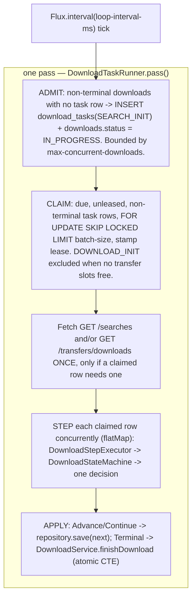

# Download Manager (Durable State Machine)

> Status: current as of 2026-08-13, branch `durable-download-state-machine`. Agent-oriented guide - the cited source files are the source of truth; verify before relying.

How a download request becomes a real slskd download and a persisted final status, and how it survives a restart at any point in between. Postgres is the workflow engine — there is no broker, no cache tier, and nothing about a download's position is held in the JVM heap. See [docs/decisions/durable-download-state-machine-13-08-2026.md](../decisions/durable-download-state-machine-13-08-2026.md) for the full rationale and rejected alternatives, and [docs/superpowers/specs/2026-08-13-durable-download-state-machine-design.md](../superpowers/specs/2026-08-13-durable-download-state-machine-design.md) for the design this doc describes.

## The pattern

A **process manager** driving **async request-reply with polling correlation**, made crash-safe by a **reconciliation loop** over a durable store. Not a saga (there is exactly one compensable effect in the whole system) and not a queue problem (a queue cannot be queried, so it cannot answer "which downloads are stuck in `DOWNLOAD_POLL`?").

Two invariants drive the design:

- **Level-triggered, not edge-triggered.** Never act on a notification that cannot be regenerated. Every pass asks the database what is due and acts on the answer, so a lost wakeup costs one loop interval instead of a download.
- **A wait held in memory is a wait that dies with the process.** Waits are persisted as a `next_attempt_at` timestamp instead.

## One loop, three steps per pass



Passes are serialised with `concatMap`, so a slow pass delays the next one — accepted for simplicity, since leases already make overlapping passes safe and switching later needs no other change. **Stepping the rows claimed within one pass is a separate axis and uses `flatMap(batch-size)`, not `concatMap`.** An earlier draft used `concatMap` at both levels, which meant a batch of `batch-size` claimed rows was stepped strictly one at a time: with `batch-size: 10` and slskd's 10s HTTP timeout, a single pass could take up to 100 seconds — reproducing, inside one pass, the exact head-of-line blocking this whole design exists to remove. `flatMap` needs no thread pool for this; WebFlux already runs an event loop per core.

Source: [DownloadTaskRunner.java](../../src/main/java/com/catacomb5099/naviseerr/download/DownloadTaskRunner.java).

## The four phases

[DownloadPhase.java](../../src/main/java/com/catacomb5099/naviseerr/download/DownloadPhase.java) defines the four steps a download moves through; each is at most one slskd call, so a crash costs at most one call's worth of work. [DownloadStateMachine.java](../../src/main/java/com/catacomb5099/naviseerr/download/DownloadStateMachine.java) is a pure function — no fields, no I/O, no clock of its own (`now` is always passed in) — that maps `(task, slskd response, now)` to a `DownloadDecision`: `Advance` (genuine phase transition, re-run next pass immediately), `Continue` (re-poll, retry the same candidate, or move to the next candidate — always rate-limited by a delay), or `Terminal` (done; write the download's status and mark the task terminal).

| Phase | slskd call | Repeats via | Poll interval (`download-task.*`) | Duration budget (`download-task.*`) | On budget exceeded |
|---|---|---|---|---|---|
| `SEARCH_INIT` | `POST /searches` | one-shot | — | — | missing/blank search id -> `Terminal FAILED` ("Searching for downloads failed") |
| `SEARCH_POLL` | reads batched `GET /searches` | `Continue` | `search-poll-interval-ms` (2000) | `search-budget-ms` (120000) | `Terminal FAILED` ("timed out") |
| `DOWNLOAD_INIT` | `POST /transfers/downloads/{user}` | `Continue` (retry/next-candidate) | `download-poll-interval-ms` used as the retry delay | — (bounded by `slskd-service.retry-count` and candidate list length, not by duration) | candidates and retries exhausted -> `Terminal FAILED` ("All download sources exhausted") |
| `DOWNLOAD_POLL` | reads batched `GET /transfers/downloads` | `Continue` | `download-poll-interval-ms` (5000) | `download-budget-ms` (3600000 = 1h) | `Terminal FAILED` ("timed out") |

A completed `SEARCH_POLL` with no usable candidates is `Terminal FAILED` ("No download candidates found"); a `DOWNLOAD_POLL` that sees any success state is `Terminal SUCCEEDED`.

`phase_entered_at` resets on a phase change (`DownloadTask.withPhase`) and is preserved across a re-poll (`DownloadTask.dueAt`), which is what makes a real duration budget possible — inverting that makes every timeout unreachable. This replaces the old `max-poll-attempts` under a doubling backoff, which had no real cap: with the previous `defaultBackoff(30, 50ms)`, the gap between polls doubled indefinitely (~51s by attempt 11, ~14 minutes by attempt 15, ~7 hours by attempt 20), so the nominal 30-attempt budget spanned roughly two years and was not a timeout in any useful sense.

A row missing from either batched map (claimed, but absent from the fetch) is deliberately treated identically to "still running", not as a distinct failure — there is no reliable way to distinguish "not there yet" from "slskd forgot it", and both resolve via the phase budget above. Same handling for a completed search with an empty candidate list vs. one still in progress.

## Leases, not a reaper

Claiming a row stamps `lease_owner` (a random UUID per process instance) and `lease_expires_at` (`now + lease-duration-ms`); the due-work query skips rows with a live lease. One mechanism does two jobs:

- It stops a second pass double-stepping a row whose slskd call is still outstanding — routine, since slskd's own timeout (10s) is longer than the loop interval (2s).
- It detects a dead process: once `lease_expires_at` passes, any instance can claim the row again.

No stale-row reaper is built or needed. Lease expiry is precise where a time-since-`updated_at` heuristic is a guess, and it is multi-instance safe for free.

## Three independent bounds

`download-task.*` in [application.yaml](../../src/main/resources/application.yaml) exposes three separate limits. Conflating them is exactly what the deleted `flatMap(this::process, 3)` did wrong:

- **`batch-size` / `loop-interval-ms`** is a hard ceiling on the rate of requests to slskd — at most `batch-size` claims per `loop-interval-ms`.
- **`max-concurrent-downloads`** caps how many *user requests* are worked on at once. It counts `downloads` rows, not task rows, so a collection of 500 songs is **one** in-flight download and cannot lock every other request out of admission. Enforced in the admit step.
- **`max-concurrent-transfers`** caps how many *real slskd transfers* exist at once — the resource that actually costs bandwidth and a peer's upload queue slot. It gates **only** the step that starts a transfer (`DOWNLOAD_INIT`), never polling: starving a poll doesn't deprioritise a download, it stalls one slskd is happily finishing, because nothing is looking at it. Enforced by excluding `DOWNLOAD_INIT` rows from the claim query when no slots are free, rather than claiming and re-deferring them — so a large collection can't spend every pass being claimed and put back.

Downloads parked in `SEARCH_POLL` or `DOWNLOAD_POLL` cost one table row each and need no bound. Work is taken oldest-first with **no per-collection cap** — one collection may legitimately hold every transfer slot until done, which is the intended default (a user who asked for something usually wants it finished). A per-user/per-collection option is future work, not hardcoded now.

## Batching the two poll phases

Polling every in-flight download's search or transfer individually costs one slskd call per download per poll — unbounded with scale. slskd exposes both as full lists, and `DownloadTaskRunner.stepAll` fetches each **once per pass**, and only when at least one claimed row in that pass actually needs it (an idle pass, or one with only `SEARCH_INIT`/`DOWNLOAD_INIT` rows, makes zero calls to either):

- `GET /searches` -> `SlskdService.getAllSearches()`, collected into a `Map<String, SearchState>` keyed by search id. No discovered downside.
- `GET /transfers/downloads` -> `SlskdService.getAllDownloads()`, collected into a `Map<String, TransferedFile>` keyed by transfer id. **Accepted risk:** unlike `GET /searches`, this endpoint has no pagination, date filter, or state filter — only `includeRemoved` — so its response size on an install with years of history was an open question at design time. The batched approach is the current default; confirm the risk assessment during Task 8, still outstanding. The documented fallback, if it ever needs to change, is per-transfer polling via the existing `getDownloadProgress`, parallelised instead of read from a shared map — a same-shape swap (one branch in `DownloadStepExecutor`, one call site in `DownloadTaskRunner`).

`DownloadStepExecutor` never calls slskd itself for `SEARCH_POLL`/`DOWNLOAD_POLL` — it reads from these two maps. This is what turns "one call per download per poll" into "two calls per pass, however many downloads are in flight." `SEARCH_INIT` and `DOWNLOAD_INIT` are not batchable in slskd's API, so those two phases still call slskd directly, once per claimed row.

**Completed-search pruning:** once a `SEARCH_POLL` sees `isComplete = true`, `DownloadStepExecutor.decideAfterSearchPoll` calls `slskdService.deleteSearch(task.searchId())` (best-effort — a failed delete just leaves one harmless extra row in slskd) regardless of whether usable candidates were found. Safe to prune, unlike a transfer: `DELETE /searches/{id}` is a distinct verb from cancelling one, a search holds no partial-download state to lose, and its candidates are already copied into the task row. This is what keeps the live `GET /searches` set small regardless of how much history accumulates.

## The atomic terminal write

Finishing a download touches two tables — `downloads.status` and the task's terminal phase — and a crash between two separate statements would reopen the stranded-row bug this design exists to close. `DownloadService.finishDownload` does both in one data-modifying CTE:

```sql
WITH updated AS (
    UPDATE downloads
       SET status = :status
     WHERE download_id = :id
       AND status NOT IN ('SUCCEEDED', 'FAILED')
    RETURNING download_id
)
UPDATE download_tasks
   SET phase = :status,
       phase_entered_at = :now,
       finished_at = :now,
       failure_reason = :reason,
       lease_owner = NULL,
       lease_expires_at = NULL
 WHERE download_id = :id
```

Postgres runs a data-modifying CTE exactly once even when nothing references it, so both halves always execute inside one statement's transaction. The task `UPDATE` is deliberately **not** conditional on the `downloads` `UPDATE` matching: if the status is already terminal (reachable whenever an expired lease causes a duplicated step), a conditional write would leave the task non-terminal, so the next pass would re-step it, re-reach `Terminal`, and change nothing — one slskd call per interval, forever (a livelock). The widened predicate (`status NOT IN ('SUCCEEDED','FAILED')` rather than `= 'IN_PROGRESS'`) removes the ambiguity of a zero-row result, turning it into a log line rather than a branch. The task row is **retained**, not deleted — its terminal phase plus `failure_reason` is the history a self-hoster needs.

## The `download_tasks` DDL

From [V2__download_tasks.sql](../../src/main/resources/db/migration/V2__download_tasks.sql):

```sql
CREATE TABLE download_tasks (
    download_id       UUID PRIMARY KEY REFERENCES downloads (download_id),
    song_name         TEXT        NOT NULL,
    phase             TEXT        NOT NULL
                                  CHECK (phase IN ('SEARCH_INIT', 'SEARCH_POLL',
                                                   'DOWNLOAD_INIT', 'DOWNLOAD_POLL',
                                                   'SUCCEEDED', 'FAILED')),
    phase_entered_at  TIMESTAMPTZ NOT NULL,
    next_attempt_at   TIMESTAMPTZ NOT NULL,
    finished_at       TIMESTAMPTZ,
    failure_reason    TEXT,
    lease_owner       TEXT,
    lease_expires_at  TIMESTAMPTZ,
    search_id         TEXT,
    candidates        TEXT        NOT NULL DEFAULT '[]',
    candidate_index   INT         NOT NULL DEFAULT 0,
    retry_index       INT         NOT NULL DEFAULT 0,
    slskd_username    TEXT,
    slskd_filename    TEXT,
    slskd_transfer_id TEXT,
    last_error        TEXT
);

CREATE INDEX idx_download_tasks_due ON download_tasks (next_attempt_at)
    WHERE phase NOT IN ('SUCCEEDED', 'FAILED');
```

`song_name` is denormalised so the hot due-work query needs no join. `candidates` is `TEXT` holding a JSON array of `DownloadCandidate`, not `JSONB` — the list is written once and read whole, never queried by content, so `JSONB`'s indexing/operators buy nothing, and storing it as JSON means adding a field to `DownloadCandidate` later needs no migration. The index is **partial** — it covers only non-terminal rows — which is what makes "retain terminal rows forever" free: the due-work query's cost is independent of history size. See [persistence.md](persistence.md) for the Flyway layout this migration lives in.

## Recovery walkthrough

Nothing about a download's position is held in memory, so every recovery scenario reduces to "what does the next pass see in the table":

- **Restart while a row is claimed and mid-poll (`SEARCH_POLL`/`DOWNLOAD_POLL`).** The dead process's lease is still live for up to `lease-duration-ms`, then expires. The next pass (this or another instance) claims the row again and re-polls from the same phase — no lost position, at most one lease-duration's delay.
- **Restart right after admit but before the first claim.** The task row already exists at `SEARCH_INIT`, `next_attempt_at = now`, no lease — the very next pass claims and steps it normally.
- **A `downloads` row ends up with no task row** (a should-not-happen state: an atomicity bug, a bad migration, a hand-edited row). The admit query matches **non-terminal** downloads (`PENDING` *or* `IN_PROGRESS`) with no task row, not just `PENDING` — so "every non-terminal download has a task row" is an invariant the loop continuously restores rather than one the code merely hopes for. Recovery restarts that download from `SEARCH_INIT`, losing its prior position, which is the accepted trade for a state that should not occur.
- **Restart between `POST /transfers/downloads/{user}` returning and the transfer id being persisted.** The one crash window this design leaves open, by explicit decision: on resume the task re-enters `DOWNLOAD_INIT` and calls slskd again, which can start a second transfer of the same file if the first one landed. The window is single-digit milliseconds; the cost is one extra duplicate file, once, per crash — judged acceptable for a self-hosted music downloader rather than worth a dedicated intent-before-effect column and write on every enqueue. See the ADR's "Accept an occasional duplicate download after a crash" decision.
- **Restart mid-terminal-write.** Impossible to observe as a split state: the terminal write is one atomic CTE (above), so a crash either lands before it (task/download stay non-terminal, next pass re-steps and re-reaches `Terminal`) or after it (both halves committed).

## Configuration (`download-task.*` in application.yaml)

| Key | Default | Meaning |
|---|---|---|
| `loop-interval-ms` | 2000 | Tick interval for the pass loop. |
| `batch-size` | 10 | Max rows admitted, and max rows claimed, per pass. |
| `lease-duration-ms` | 60000 | How long a claim's lease survives before another pass may reclaim the row. |
| `max-concurrent-downloads` | 20 | Cap on in-flight `downloads` rows (user requests), enforced at admit. |
| `max-concurrent-transfers` | 20 | Cap on real slskd transfers (`DOWNLOAD_POLL` task rows only - `DOWNLOAD_INIT` is excluded from the count so the gate can't deadlock), enforced at claim. |
| `search-poll-interval-ms` | 2000 | Re-poll cadence for `SEARCH_POLL`. |
| `download-poll-interval-ms` | 5000 | Re-poll cadence for `DOWNLOAD_POLL`, and the retry/next-candidate delay from `DOWNLOAD_INIT`. |
| `search-budget-ms` | 120000 | Max time in `SEARCH_POLL` before `Terminal FAILED` ("timed out"). |
| `download-budget-ms` | 3600000 | Max time in `DOWNLOAD_POLL` before `Terminal FAILED` ("timed out"). |

`slskd-service.retry-count` (unchanged) still governs the candidate-level retry count applied in `DOWNLOAD_INIT`/`DOWNLOAD_POLL` failure handling.

## Components

- [DownloadController.java](../../src/main/java/com/catacomb5099/naviseerr/download/DownloadController.java) - `POST /download/{songName}`; inserts a `PENDING` row via `DownloadService.requestDownload` and returns `202 Accepted`. No work beyond persisting intent.
- [DownloadTaskRunner.java](../../src/main/java/com/catacomb5099/naviseerr/download/DownloadTaskRunner.java) - the loop: admit, claim, fetch-if-needed, step, apply. Owns the `@PostConstruct`/`@PreDestroy` subscription lifecycle and the `instanceId` used as `lease_owner`.
- [DownloadStepExecutor.java](../../src/main/java/com/catacomb5099/naviseerr/download/DownloadStepExecutor.java) - the I/O shell around the state machine; one slskd call (or a batched-map read) per phase; never propagates an error signal — an slskd failure becomes `DownloadStateMachine.onCallFailed`, so the caller always has a decision to write.
- [DownloadStateMachine.java](../../src/main/java/com/catacomb5099/naviseerr/download/DownloadStateMachine.java) - the pure branch matrix. See the phase table above.
- [DownloadTask.java](../../src/main/java/com/catacomb5099/naviseerr/download/DownloadTask.java) - in-memory carrier for one `download_tasks` row; this record *is* the durable state, read and written whole on every step.
- [DownloadDecision.java](../../src/main/java/com/catacomb5099/naviseerr/download/DownloadDecision.java) - sealed `Advance` / `Continue` / `Terminal`.
- [DownloadTaskRepository.java](../../src/main/java/com/catacomb5099/naviseerr/download/DownloadTaskRepository.java) - all `download_tasks` SQL: admit CTE, lease-based claim, save, the two active-count queries.
- [DownloadService.java](../../src/main/java/com/catacomb5099/naviseerr/download/DownloadService.java) - `requestDownload` (insert `PENDING`) and `finishDownload` (the atomic terminal CTE above). See [persistence.md](persistence.md).

## Related docs

- slskd flow internals: [slskd-integration.md](slskd-integration.md)
- DB, SQL, and the Flyway layout: [persistence.md](persistence.md)
- Reactor patterns (the pass/row concurrency split): [reactive-patterns.md](reactive-patterns.md)
- ADR (rationale, options considered, rejected alternatives): [docs/decisions/durable-download-state-machine-13-08-2026.md](../decisions/durable-download-state-machine-13-08-2026.md)
- Design spec: [docs/superpowers/specs/2026-08-13-durable-download-state-machine-design.md](../superpowers/specs/2026-08-13-durable-download-state-machine-design.md)
