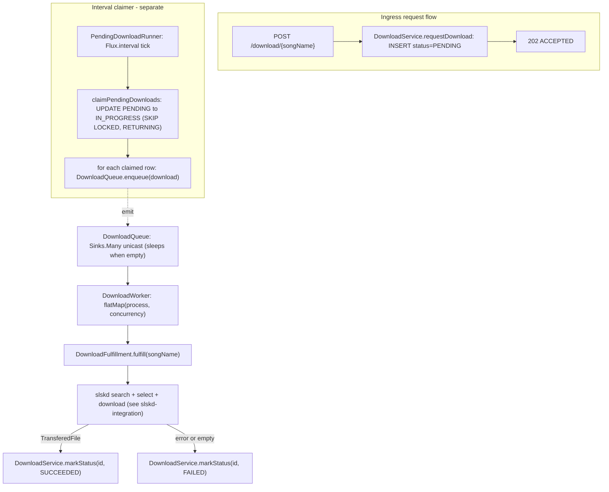

# Download Manager (Event-Driven Queue)

> Status: current as of 2026-06-29, branch `event-driven-download-queue`. Agent-oriented guide - the cited source files are the source of truth; verify before relying.

How a download request becomes a real slskd download and a persisted final status. The design has three decoupled concerns so the HTTP request stays fast and the heavy work runs in the background.

## The three concerns

1. Ingress (request flow) - persist a `PENDING` row and return immediately.
2. Claim + emit (interval) - a background runner flips `PENDING -> IN_PROGRESS` on an interval and emits each claimed row into an in-memory queue. The transition is what triggers enqueueing.
3. Process (event-driven) - a worker sleeps on the queue, wakes on emit, runs the slskd flow with bounded concurrency, and writes the terminal status.

"No polling / sleep-and-wake" applies to the queue -> worker hop. The claim step is deliberately interval-driven, and the DB `downloads` table is the durable ingress; the in-memory queue is just the processing buffer.

## Flow

## Components

- [DownloadController.java](../../src/main/java/com/catacomb5099/naviseerr/download/DownloadController.java) - `POST /download/{songName}`; validates, calls `requestDownload`, returns `202 Accepted` (or `400`/`500`). No work beyond persisting intent.
- [DownloadService.java](../../src/main/java/com/catacomb5099/naviseerr/download/DownloadService.java) - `requestDownload` (insert `PENDING`), `claimPendingDownloads` (atomic batch claim), `markStatus` (transactional terminal write). See [persistence.md](persistence.md).
- [PendingDownloadRunner.java](../../src/main/java/com/catacomb5099/naviseerr/download/PendingDownloadRunner.java) - `@PostConstruct` starts `Flux.interval(...).onBackpressureDrop().concatMap(tick -> processBatch())`. `processBatch()` claims a batch and calls `downloadQueue.enqueue(...)` for each claimed (now `IN_PROGRESS`) row. Errors per cycle are logged and swallowed so the loop keeps running.
- [DownloadQueue.java](../../src/main/java/com/catacomb5099/naviseerr/download/DownloadQueue.java) - wraps `Sinks.many().unicast().onBackpressureBuffer()`. `enqueue(Download)` uses `tryEmitNext` (single producer = the runner, so emission is naturally serialized); `asFlux()` is the worker's source. See [reactive-patterns.md](reactive-patterns.md).
- [DownloadWorker.java](../../src/main/java/com/catacomb5099/naviseerr/download/DownloadWorker.java) - `@PostConstruct` subscribes once: `downloadQueue.asFlux().flatMap(this::process, concurrency)`. `process(download)` runs `DownloadFulfillment.fulfill` then writes status. Every item is isolated (`onErrorResume`) so one failure never tears down the subscription.
- [DownloadFulfillment.java](../../src/main/java/com/catacomb5099/naviseerr/download/DownloadFulfillment.java) - `fulfill(songName)` = the slskd `pollUntilComplete -> selectBestFiles -> pollUntilComplete` chain (see [slskd-integration.md](slskd-integration.md)). Pure acquisition; no DB writes.

## Terminal status mapping

`DownloadWorker.process` maps every outcome to a single terminal write:

- emits a `TransferedFile` -> `markStatus(id, SUCCEEDED)`
- completes empty (no candidates / all exhausted) -> `switchIfEmpty` -> `markStatus(id, FAILED)`
- errors (retries exhausted / provider error) -> `onErrorResume` -> `markStatus(id, FAILED)`

Both empty and error map to `FAILED` because the slskd flow signals "did not succeed" either way (see [slskd-integration.md](slskd-integration.md)). `markStatus` is guarded to only update rows currently `IN_PROGRESS`.

Status lifecycle: `PENDING` (ingress) -> `IN_PROGRESS` (claim) -> `SUCCEEDED` | `FAILED` (worker). Defined in [DownloadStatus.java](../../src/main/java/com/catacomb5099/naviseerr/download/DownloadStatus.java).

## Configuration

- `download-runner.interval-ms` (10000) - claim interval.
- `download-runner.batch-size` (10) - rows claimed per tick.
- `download-worker.concurrency` (3) - max downloads processed in parallel by the worker.

## Resilience gap (must-do, not yet implemented)

The work queue is in-memory only. Because the DB is the durable ingress:

- `PENDING` rows are auto-recovered: after a restart the next claim interval picks them up.
- Rows already flipped to `IN_PROGRESS` when the process dies are stranded: the claimer only claims `PENDING`, and the in-memory queue contents are lost.

This must be addressed: a reaper/timeout that reclaims stale `IN_PROGRESS` rows (reset to `PENDING` or re-enqueue) with idempotent reprocessing, plus queue overflow/backpressure to the claimer (the Sinks buffer is unbounded), and eventually a durable broker. Tracked in [gotchas.md](gotchas.md) and `AGENTS.md`.

## Current vs target

Target (per `AGENTS.md`, not built): RabbitMQ owns execution state and pipeline steps; Redis owns ephemeral progress/quotas/SSE cursors; SSE pushes progress; delayed/requeued messages handle retries/throttling; a DLQ holds exhausted/unrecoverable work. The current in-memory queue is the minimal first cut.

## Related docs

- slskd flow internals: [slskd-integration.md](slskd-integration.md)
- DB and SQL: [persistence.md](persistence.md)
- Reactor patterns (Sinks, retry): [reactive-patterns.md](reactive-patterns.md)
- ADR (rationale): [docs/decisions/event-driven-download-queue-29-06-2026.md](../decisions/event-driven-download-queue-29-06-2026.md)
