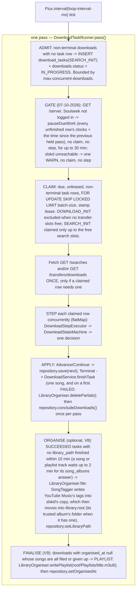

# Download Manager (Durable State Machine)

> Status: current as of 2026-08-13, branch `durable-download-state-machine`. Agent-oriented guide - the cited source files are the source of truth; verify before relying.

How a download request becomes a real slskd download and a persisted final status, and how it survives a restart at any point in between. Postgres is the workflow engine — there is no broker, no cache tier, and nothing about a download's position is held in the JVM heap. See [docs/decisions/durable-download-state-machine-13-08-2026.md](../decisions/durable-download-state-machine-13-08-2026.md) for the full rationale and rejected alternatives, and [docs/superpowers/specs/2026-08-13-durable-download-state-machine-design.md](../superpowers/specs/2026-08-13-durable-download-state-machine-design.md) for the design this doc describes.

## The pattern

A **process manager** driving **async request-reply with polling correlation**, made crash-safe by a **reconciliation loop** over a durable store. Not a saga (there is exactly one compensable effect in the whole system) and not a queue problem (a queue cannot be queried, so it cannot answer "which downloads are stuck in `DOWNLOAD_POLL`?").

Two invariants drive the design:

- **Level-triggered, not edge-triggered.** Never act on a notification that cannot be regenerated. Every pass asks the database what is due and acts on the answer, so a lost wakeup costs one loop interval instead of a download.
- **A wait held in memory is a wait that dies with the process.** Waits are persisted as a `next_attempt_at` timestamp instead.

## One loop, three steps per pass


```mermaid
flowchart TD
    tick["Flux.interval(loop-interval-ms) tick"] --> admit
    subgraph pass ["one pass — DownloadTaskRunner.pass()"]
      admit["ADMIT: non-terminal downloads with no task row -> INSERT download_tasks(SEARCH_INIT) + downloads.status = IN_PROGRESS. Bounded by max-concurrent-downloads."]
      admit --> gate["GATE (07-10-2026): GET /server. Soulseek not logged in -> pauseDueWork (every unfinished row's clocks + the time since the previous held pass), no claim, no step, for up to 30 min; slskd unreachable -> one WARN, no claim, no step"]
      gate --> claim["CLAIM: due, unleased, non-terminal task rows, FOR UPDATE SKIP LOCKED LIMIT batch-size, stamp lease. DOWNLOAD_INIT excluded when no transfer slots free; SEARCH_INIT claimed only up to the free search slots."]
      claim --> fetch["Fetch GET /searches and/or GET /transfers/downloads ONCE, only if a claimed row needs one"]
      fetch --> step["STEP each claimed row concurrently (flatMap): DownloadStepExecutor -> DownloadStateMachine -> one decision"]
      step --> apply["APPLY: Advance/Continue -> repository.save(next); Terminal -> DownloadService.finishTask (one song, and on a first FAILED: LibraryOrganiser.deletePartials); then repository.concludeDownloads() once per pass"]
      apply --> organise["ORGANISE (optional, V8): SUCCEEDED tasks with no library_path finished within 10 min (a song or playlist track waits up to 2 min for its song_albums answer) -> LibraryOrganiser.file: SongTagger writes YouTube Music's tags into slskd's copy, which then moves into library.root (its trusted album's folder when it has one), repository.setLibraryPath"]
      organise --> finalise["FINALISE (V9): downloads with organised_at null whose songs are all filed or given up -> PLAYLIST: LibraryOrganiser.writePlaylist(root/Playlists/title.m3u8); then repository.setOrganisedAt"]
    end
```

The organise step (27-09-2026) is off unless `library.slskd-downloads-dir` and `library.root` are both set; with them unset the pass is exactly the four steps above it. It is the same level-triggered shape: the table is asked which finished songs have not been filed, so a song whose file was not moved yet is picked up again next pass. File I/O runs on `Schedulers.boundedElastic()`, never on the event loop. Folder scheme, safety rules and the give-up window are in [the ADR](../decisions/library-organiser-27-09-2026.md).

**Tagging rides on filing** (04-10-2026). `LibraryOrganiser.file` first asks `SongTagger.cover` for the album's art (a reactive fetch, kept per album in a small in-memory cache, empty on any failure), then on `boundedElastic` calls `SongTagger.tag` on the located source file and only then moves it. `tag` never throws, takes a process-wide lock (the tag library's options are one global), and is idempotent, so a move that fails and is retried next pass just tags again. The rules (P1 override under a trusted album, P2 fill-only, P10 untaggable files filed as they are) are in [the ADR](../decisions/youtube-album-tags-04-10-2026.md#tags-p1-p2-p10-b2).

**A song the library already has is never fetched again** (04-10-2026). Admission asks `repository.filedCopies` for EXACT, filed copies of the songs it is about to create (same album track, a song's album counting only from an answer saved before it was filed, or for a non-album download the same id and title), checks on `boundedElastic` that each file is still in the library (`LibraryOrganiser.stillFiled`), and `createTasks` writes those rows `SUCCEEDED` with their `library_path` in the same insert, so no claim ever sees them. Filing does the same for a song whose album track (or id and title) was filed in the meantime: `Job.filedCopy` set, the new copy is deleted when its size is the pick's, and the task points at the library's file; `organise` groups the batch by `Job.copyKey` and files one copy of a song at a time, skipping the rest of the group for the pass once one is filed. [ADR](../decisions/youtube-album-tags-04-10-2026.md#already-owned-p7-b3).

**The album lookup is a second loop, not a step** (04-10-2026). `SongAlbumResolver` has its own `Flux.interval(loop-interval-ms)` subscription, on only when the organiser is, and `concatMap`s one song at a time through the adapter (two to six calls of 1-15 s each, which must never hold up searching and polling). Each tick: `songsToResolve(batch-size, organiser cutoff, now - 7 days)` — songs and playlist tracks (never an album download's) still downloading, or finished and unfiled within the organiser's window, with no `song_albums` answer or a week-old "none"; never the history — then per song the curator's album id (CURATED) or `/details`, the song search when that gives no trusted album, the plainest edition, and `upsertMedia(album row)` + `saveSongAlbum`. An adapter outage writes nothing and the song is asked again next tick. The organiser's filing query holds a finished song or playlist track back until it has an answer or two minutes have passed (`LibraryOrganiser.ALBUM_LOOKUP_GRACE`), in the WHERE so waiting rows never fill the batch. Rules and measurements: [the ADR](../decisions/youtube-album-tags-04-10-2026.md).

**Soulseek offline: downloads wait** (07-10-2026). Every pass first asks slskd `GET /server` (the call the idle keep-alive used to make, now unconditional). While it answers `isLoggedIn=false` -- the internet is down, or slskd is reconnecting -- nothing is claimed or stepped; instead one statement, `DownloadTaskRepository.pauseDueWork`, moves `phase_entered_at` and `next_attempt_at` of every unfinished `download_tasks` and `album_searches` row forward by the time since the previous held pass, the first by one loop interval (an overdue row becomes due that long from now, a later one keeps its distance; measured time, not the interval, because admission can hold a pass for 45 s waiting on ytmusic-adapter while the internet is down), so no search or download budget runs down and nothing fails while nothing could be done. Conclusion and filing still run. One INFO line on each transition (offline, back), none per pass. Ceiling: `DownloadTaskRunner.OFFLINE_PAUSE_CEILING` (30 minutes, a constant, not a property): past it, one WARN and stepping resumes as before, so the songs fail as `SOULSEEK_OFFLINE` from slskd's 409 and a wrong Soulseek password still ends in a red card that says why rather than cards that say Searching for ever. slskd itself being unreachable is a different outage: the pass logs one WARN with the reason, claims and steps nothing, and the rest of the pass runs; the clocks are **not** held, so a long slskd outage still fails songs as it did before. Known ceilings: a transfer slskd marked Errored during the outage still costs one of its two same-candidate retries when stepping resumes, and a search slskd completed empty during the outage still advances a wording -- one retry lost, not a song. [ADR](../decisions/soulseek-outage-pause-07-10-2026.md).

**Post-processing after a retry or a pick** (09-10-2026). ORGANISE and FINALISE are the post-processing step, and they are level-triggered on two nullable columns: `download_tasks.library_path` (filed) and `downloads.organised_at` (playlist written). A retry (whole or one song) and a manual pick reset the song and clear the collection's `organised_at` in their own statement; when the song lands and is filed, `concludeDownloads` closes the collection again and FINALISE regenerates the whole `.m3u8` from every `SUCCEEDED` song that has a file, in track order, however long after the first write. Siblings already filed keep their `library_path` and are not touched. The safety net for what those statements cannot see is `REOPEN_SQL`, run by `concludeDownloads()` before `CONCLUDE_SQL` every pass: a finished collection with a song that is live again (a one-song retry that committed between the conclude statement's snapshot and its write, or any later path that revives a song) goes back to `IN_PROGRESS` with `finished_at`, `failure_reason` and `organised_at` cleared, so it is concluded and post-processed again once that song settles. Without it such a collection kept a terminal word with a live song and its playlist was written short, once, for good. Tags are written once, at filing, from the stored YouTube details; a late album answer is never applied to a filed file, and a song whose details are missing is filed by its own name with fill-only tags. [ADR](../decisions/playlist-post-processing-09-10-2026.md).

Passes are serialised with `concatMap`, so a slow pass delays the next one — accepted for simplicity, since leases already make overlapping passes safe and switching later needs no other change. **Stepping the rows claimed within one pass is a separate axis and uses `flatMap(batch-size)`, not `concatMap`.** An earlier draft used `concatMap` at both levels, which meant a batch of `batch-size` claimed rows was stepped strictly one at a time: with `batch-size: 10` and slskd's 10s HTTP timeout, a single pass could take up to 100 seconds — reproducing, inside one pass, the exact head-of-line blocking this whole design exists to remove. `flatMap` needs no thread pool for this; WebFlux already runs an event loop per core.

Source: [DownloadTaskRunner.java](../../src/main/java/com/catacomb5099/naviseerr/download/DownloadTaskRunner.java).

## The four phases

[DownloadPhase.java](../../src/main/java/com/catacomb5099/naviseerr/download/DownloadPhase.java) defines the four steps a download moves through; each is at most one slskd call, so a crash costs at most one call's worth of work. [DownloadStateMachine.java](../../src/main/java/com/catacomb5099/naviseerr/download/DownloadStateMachine.java) is a pure function — no fields, no I/O, no clock of its own (`now` is always passed in) — that maps `(task, slskd response, now)` to a `DownloadDecision`: `Advance` (genuine phase transition, re-run next pass immediately), `Continue` (re-poll, retry the same candidate, or move to the next candidate — always rate-limited by a delay), or `Terminal` (done; write the download's status and mark the task terminal).

| Phase | slskd call | Repeats via | Poll interval (`download-task.*`) | Duration budget (`download-task.*`) | On budget exceeded |
|---|---|---|---|---|---|
| `SEARCH_INIT` | `POST /searches` | `Continue` when the call fails: retried while the search budget lasts and at least `slskd-service.retry-count` times whatever the clock says (the budget's clock started when the row was created, and the row may have waited minutes for a search slot); the error is kept in `last_error`, with slskd's own reason when it gave one | `search-poll-interval-ms` as the retry delay | `search-budget-ms` or the retry count, whichever lasts longer | missing/blank search id, or the retries used up -> `Terminal FAILED` (`SEARCH_FAILED`; `SOULSEEK_OFFLINE` when the last refusal was slskd's 409 "must be connected and logged in"), unless files kept from an earlier wording can be downloaded instead |
| `SEARCH_POLL` | reads batched `GET /searches` | `Continue` | `search-poll-interval-ms` (2000) | `search-budget-ms` (120000) | `Terminal FAILED` ("timed out") |
| `DOWNLOAD_INIT` | `POST /transfers/downloads/{user}`, or none when the candidate's sharer already holds `max-transfers-per-sharer` of our transfers (then `Continue`, same candidate, until one of them finishes); a held song whose sharer has gone on the stalling list moves to its next candidate | `Continue` (retry/next-candidate) | `download-poll-interval-ms` used as the retry delay | — (bounded by `slskd-service.retry-count` and candidate list length, not by duration) | candidates and retries exhausted -> `Terminal FAILED` ("All download sources exhausted") |
| `DOWNLOAD_POLL` | reads batched `GET /transfers/downloads` | `Continue` | `download-poll-interval-ms` (5000) | `download-budget-ms` (3600000 = 1h); `queued-budget-ms` (600000 = 10 min) while the peer has not sent a byte (`Queued, Remotely`/`Requested`/`Initializing`, or `InProgress` at 0 bytes; `Queued, Locally` is slskd's own backlog and is excluded); both slide while the sharer is sending us another of our files (see "One sharer, many songs"); `missing-transfer-grace-ms` (60000) when the transfer is absent from the response | `Terminal FAILED` ("timed out", or "slskd has no record of this transfer"); queued budget exceeded -> the sharer goes on the in-memory stalling list (`StallingSharers`), the abandoned transfer is cancelled in slskd (best effort, `SlskdService.cancelDownload`), and `Continue` to the **next candidate** (same-peer retries skipped), or `Terminal FAILED` ("All download sources exhausted") when it was the last. `Completed, Rejected` ("File not shared", "Overwhelmed with requests") also goes straight to the next candidate, never a same-file retry |

A completed `SEARCH_POLL` with no usable candidates is `Terminal FAILED` ("No download candidates found"); a `DOWNLOAD_POLL` that sees any success state is `Terminal SUCCEEDED`. Before that failure, a song that still has a wording left is sent back to `SEARCH_INIT` with `search_tier + 1` (`Advance`, fresh search budget) — `SearchQueryTiers` derives up to four queries from `song_name` (first the title alone with brackets, quotes, version words and guest credits gone — the owner's call of 28-09-2026, see [title-first-search-28-09-2026.md](../decisions/title-first-search-28-09-2026.md) — then the bare "title - artist", then the two names each minus one word ("Romance Gaga": Soulseek silently drops any search containing every word of certain artist names and hit titles), then, for a title longer than five words, the short title with the artist; the candidate picker judges against the cleaned `SearchQueryTiers.pickerName`, qualifiers included, and when the wording did not name the artist it requires the artist in the file's path). The first wording moves on when it finds fewer than `first-wording-min-candidates` (3) acceptable files, keeping the ones it found in case the artist wordings return nothing (Soulseek silently drops searches naming certain artists); the later wordings move on only on zero. Only the "search complete" branch ever advances a tier. Because the wire maps `SEARCH_INIT` to `STARTING`, a client that polls in the one tick between tiers sees `STARTING` and a reset `stage_entered_at` before `SEARCHING` returns; that is the fresh budget showing through, accepted rather than special-cased on the wire.

`phase_entered_at` resets on a phase change (`DownloadTask.withPhase`) and is preserved across a re-poll (`DownloadTask.dueAt`), which is what makes a real duration budget possible — inverting that makes every timeout unreachable. This replaces the old `max-poll-attempts` under a doubling backoff, which had no real cap: with the previous `defaultBackoff(30, 50ms)`, the gap between polls doubled indefinitely (~51s by attempt 11, ~14 minutes by attempt 15, ~7 hours by attempt 20), so the nominal 30-attempt budget spanned roughly two years and was not a timeout in any useful sense. The one deliberate exception is a `DOWNLOAD_POLL` row waiting its turn behind another of our files from the same sharer (below): its clock moves to now on every poll, so its budgets count from the last moment that sharer was busy with us.

### One sharer, many songs (P9, 04-10-2026)

A Soulseek sharer sends one or two files at a time and queues the rest. Before this, each of many songs from one sharer had its own ten minutes in that queue: any still waiting after that was given up on, and the sharer went on the stalling list for six hours, while it was busy sending us the others; and a song that did wait an hour was `TIMED_OUT` the moment its own bytes started (the hour counted from when it was queued). Now:

- `DownloadTaskRunner` reads `DownloadTaskRepository.transfersInFlight()` once per pass (every `DOWNLOAD_POLL` row's `slskd_username` and `slskd_transfer_id`; its size is also the `max-concurrent-transfers` count) and, after the batched `GET /transfers/downloads`, builds a `SharerLoad`: the sharers with one of OUR transfers `InProgress` with bytes moved (`DownloadStateMachine.isDelivering`), and how many of our transfers each holds. All of ours, not just the rows claimed this pass — a pass claims at most `batch-size` rows, so the sibling being sent is often not among them. Never slskd's other transfers: the owner's manual downloads or another install's would make the wait unbounded.
- `afterDownloadPoll`: a waiting row (the queued-budget definition) whose sharer is in the delivering set returns `Continue` with `phase_entered_at = now`. Both budgets slide, which also covers the gap between one file completing and the next starting. Not marked stalling, not cancelled. Bounded by our own transfers with that sharer, each with its own hour once it starts.
- `beforeDownloadInit`: a `DOWNLOAD_INIT` whose candidate's sharer already holds `max-transfers-per-sharer` (2) of ours returns `Continue` at `download-poll-interval-ms`, same candidate, without calling slskd. A held song whose sharer has meanwhile gone on the stalling list moves to its next non-stalling candidate instead (as a failover would), so it does not spend its own ten minutes there once the sharer's count drops. `SharerLoad.take` counts each `DOWNLOAD_INIT` stepped in the pass, so ten songs released together cannot all see a free place. Held rows are claimed and put back every poll interval and share `batch-size` with the real polls (a `ponytail:` note in the code names the upgrade: leave them out of the claim).

### Whole album first (P5, 04-10-2026)

An `ALBUM` download first looks for one sharer's folder holding every track and downloads just those files from it; with no such folder, the folder holding the most of them (at least half, at least two) supplies those (P6) ([ADR](../decisions/whole-album-downloads-04-10-2026.md)). Three pieces:

- **`album_searches`** (V12): one row per album download, a two-phase state machine of its own (`SEARCH_INIT` → `SEARCH_POLL` → `DONE`, with `search_tier`, `search_id`, `next_attempt_at`, a lease and an `outcome`: `WHOLE_FOLDER`, `PART_FOLDER`, `NO_WHOLE_FOLDER`, `NOTHING_TO_SEARCH`, `SEARCH_FAILED`, `CANCELLED`). `CREATE_TASKS_SQL` inserts it in the same statement as the songs, and writes the songs **held**: due at now + 2 × `search-budget-ms` (`AlbumSearchStep.holdUntil`), so the claim skips them. Nothing else holds them: if the album step dies, they fall due and search on their own.
- **`AlbumSearchStep`**, stepped by the runner. `stepDueTasks` claims due album searches first (`claimDueAlbumSearches`: every poll, starts up to the free search slots) and passes `searchSlots - album starts` to `claimDueTasks`; `countActiveSearches` adds album `SEARCH_POLL` rows. Album starts are stepped at the head of the one-at-a-time `SEARCH_INIT` queue; album polls read the batched `GET /searches` like song polls. `SEARCH_INIT`: no song still waiting → `DONE` (`NOTHING_TO_SEARCH`) without searching; otherwise one `POST /searches` (the clean album name alone, never the artist; `AlbumSearch.wordings`), saved as `SEARCH_POLL` while re-extending the held songs' hold (`SAVE_ALBUM_SEARCH_SQL`); a start slskd refuses → `DONE` (`SEARCH_FAILED`). `SEARCH_POLL`: not complete and within `search-budget-ms` → poll again at `search-poll-interval-ms`; otherwise fetch the responses once and run `AlbumFolderPicker.folders` (on `Schedulers.parallel()`: 250 responses take about 0.2 s; whole folders first, then parts by songs held) and release. There is no second wording (07-10-2026).
- **One release statement**, `RELEASE_ALBUM_SONGS_SQL`: a CTE marks the row `DONE` `WHERE lease_owner = :owner AND phase <> 'DONE'`, and only if that matched, the songs still untouched (`SEARCH_INIT`, `search_id IS NULL`, `search_tier = 0`, `candidates = '[]'`, lease expired or null) are released: each song the best folder holds to `DOWNLOAD_INIT` with up to three candidates (its file in the best folder, then the next folders of other sharers that have it) marked `source: "ALBUM_FOLDER"`; every other one, including a song only a later part folder has, stays `SEARCH_INIT` due now. All get `phase_entered_at = next_attempt_at = now` and no lease.

When a song's `ALBUM_FOLDER` candidates are all used up, `nextCandidate` returns `Advance` to `SEARCH_INIT`, tier 0, candidates cleared (the song's own search, with a fresh budget) instead of `SOURCES_EXHAUSTED`, and `apply` deletes the partial files of the folder attempts. Whole-download cancel ends the album search (`CANCEL_SQL` CTE, outcome `CANCELLED`). A whole-download retry restarts it (`RETRY_SQL`'s `album` CTE, 09-10-2026): the row goes back to `SEARCH_INIT` and the reset songs are held for it (`:holdUntil`, the fresh-album hold from `AlbumSearchStep.holdUntil`, passed by `DownloadService.retry`), the remembered folders left in place for the picker; one track's retry (`:taskId`) does not restart it: that track searches on its own, `track_number`/`duration_seconds` intact so the length filter still applies.

An album's song on its own search (`DownloadStepExecutor`, `DownloadTask.albumTrackSeconds`: a task with a YouTube track number) passes the album row's length to `selectBestFiles`, which drops every graded file slskd gives a length for that is outside `SlskdSearchResultProcessor.lengthTolerance` (max(10 s, 3%), shared with the picker) before the unverified-artist rule and the ranking. So the tier rule and the no-candidates failure see only files of the right length; a song or playlist track passes null and keeps any length.

### Choosing the file by hand (manual pick, 07-10-2026)

A person can replace the file a song downloads from, or the folder an album downloads from, with one
Soulseek offered ([ADR](../decisions/manual-pick-07-10-2026.md)). Three pieces:

- **Remembering what the search found** (V15, see [persistence.md](persistence.md#v15-what-a-search-found-remembered-manual-pick-07-10-2026)):
  `DownloadStepExecutor.remember` writes every graded file of the completed search (any format, the
  picker's order, up to `REMEMBERED_FILES` = 100, `SlskdSearchResultProcessor.relevantFiles`) to
  `download_tasks.search_results` right after the one refetch, before `selectBestFiles` runs;
  `AlbumSearchStep.judge` writes the judged folders (up to `REMEMBERED_FOLDERS` = 20, `StoredFolder`) to
  `album_searches.folders`, also when it moves on to the next wording. Both swallow and log their own
  errors: a cache miss costs a person a retry, a failed search costs them the song.
- **The lists** (`DownloadService.candidates` / `albumCandidates`): read whole from the caches, never
  from slskd. A song with no list of its own that got its file from the album search lists the
  remembered folders that hold it. `status` is `READY`, `SEARCHING` (the loop is still searching; the
  client polls again) or `NONE` with a reason; nothing is searched from the request thread. Since
  09-10-2026 the reason is read off the row's own columns (`search_id`, `failure_reason`, the album
  search's `outcome` and `finished_at`), so an empty list says whether the search was ever made, and
  both views carry slskd's `searchId` so a person can find the search in slskd's own history.
- **The pick** (`DownloadService.pick` / `albumPick`, `PICK_SQL`): the song is reset in place to
  `DOWNLOAD_INIT` with the chosen file as its ONLY candidate (grade EXACT, source `MANUAL`), index and
  retries 0, slskd columns and progress cleared, lease cleared, and a `FAILED`/`PARTIAL_SUCCESS` download
  reopened -- `RETRY_SQL`'s shape. The statement returns the OLD row (a second scan of the table in the
  same statement), and `stopInSlskd` then cancels its transfer and deletes its partial files exactly as
  cancel does. An album pick does this for every unfinished song the folder holds and leaves the rest
  alone. From there the ordinary loop enqueues the file, subject to the transfer gate and
  `max-transfers-per-sharer`. If the chosen file fails, the one-element list ends `SOURCES_EXHAUSTED`
  (no fallback to the automatic list) and the person picks again. A `SUCCEEDED` song is refused (409).

The two batched maps now handle a missing entry **differently**, and the asymmetry is deliberate.

- **A search missing from `GET /searches`** is still treated as "still running". There is no reliable way to distinguish "not there yet" from "slskd forgot it", and it resolves via `search-budget-ms`.
- **A transfer missing from `GET /transfers/downloads`** gets its own branch and a much shorter budget, `missing-transfer-grace-ms` (60s), after which it is `Terminal FAILED` ("slskd has no record of this transfer"). slskd *retains* completed transfers in that list — a finished one still reports `"Completed, Succeeded"` with `removed: false` — so absence is a genuine signal rather than a normal lifecycle stage.

That asymmetry was learned the hard way. Aliasing the transfer case onto "still running" meant a lookup that could **never** resolve was indistinguishable from a transfer making progress, so a row polled for the full hour-long `download-budget-ms` and then reported a timeout — for a download that had already succeeded. The nested-response bug above is what produced it, and the aliasing is what made it silent. A shortfall between tracked ids and matched transfers is now logged at WARN for the same reason.

## Leases, not a reaper

Claiming a row stamps `lease_owner` (a random UUID per process instance) and `lease_expires_at` (`now + lease-duration-ms`); the due-work query skips rows with a live lease. One mechanism does two jobs:

- It stops a second pass double-stepping a row whose slskd call is still outstanding — routine, since slskd's own timeout (10s) is longer than the loop interval (2s).
- It detects a dead process: once `lease_expires_at` passes, any instance can claim the row again.

No stale-row reaper is built or needed. Lease expiry is precise where a time-since-`updated_at` heuristic is a guess, and it is multi-instance safe for free.

## Four independent bounds

`download-task.*` in [application.yaml](../../src/main/resources/application.yaml) exposes four separate limits. Conflating them is exactly what the deleted `flatMap(this::process, 3)` did wrong:

- **`batch-size` / `loop-interval-ms`** is a hard ceiling on the rate of requests to slskd — at most `batch-size` claims per `loop-interval-ms`.
- **`max-concurrent-downloads`** caps how many *user requests* are worked on at once. It counts `downloads` rows, not task rows, so a collection of 500 songs is **one** in-flight download and cannot lock every other request out of admission. Enforced in the admit step.
- **`max-concurrent-transfers`** caps how many *real slskd transfers* exist at once — the resource that actually costs bandwidth and a peer's upload queue slot. It gates **only** the step that starts a transfer (`DOWNLOAD_INIT`), never polling: starving a poll doesn't deprioritise a download, it stalls one slskd is happily finishing, because nothing is looking at it. Enforced by excluding `DOWNLOAD_INIT` rows from the claim query when no slots are free, rather than claiming and re-deferring them — so a large collection can't spend every pass being claimed and put back. Inside it, `max-transfers-per-sharer` caps our transfers with any one sharer (see "One sharer, many songs"); that one is enforced per row at `DOWNLOAD_INIT`, since the sharer is inside the candidate list.

- **`max-concurrent-searches`** (added 27-09-2026) caps how many *Soulseek searches* are running at once. slskd itself only ever sends two searches to the server at a time — a literal `2` in slskd 0.24+, not configurable — and queues the rest, in order, inside itself, while still answering every `POST /searches` with 200 straight away. So starting a 50-song playlist's searches in one go does not make them faster; it builds a queue inside slskd, and our `search-budget-ms` clock (which starts at submission) charges that queue time against each search. Measured 27-09-2026: 50 searches submitted in a minute, completed strictly one after another over 4.5 minutes, 26 of them *after* naviseerr had already failed them as `TIMED_OUT` — many holding 250 responses. The default matches slskd's slot count. It counts `SEARCH_POLL` rows and gates **only** `SEARCH_INIT` (starting a search), never polling — and unlike the transfer gate it is a **count, not a yes/no**: the claim takes the number of free slots and claims at most that many `SEARCH_INIT` rows, because a yes/no gate would let one pass claim `batch-size` searches the moment the count dipped under two. `SEARCH_INIT` rows within a pass are also stepped one after another rather than concurrently, because slskd answers an overlapping `POST /searches` with 429. Album searches (see "Whole album first") count against the same cap: `COUNT_ACTIVE_SEARCHES_SQL` adds their `SEARCH_POLL` rows, and they are claimed first, the songs taking only the slots left.

Downloads parked in `SEARCH_POLL` or `DOWNLOAD_POLL` cost one table row each and need no bound. Work is taken oldest-first with **no per-collection cap** (only the per-sharer one) — one collection may legitimately hold every transfer slot until done, which is the intended default (a user who asked for something usually wants it finished). A per-user/per-collection option is future work, not hardcoded now.

## Batching the two poll phases

Polling every in-flight download's search or transfer individually costs one slskd call per download per poll — unbounded with scale. slskd exposes both as full lists, and `DownloadTaskRunner.stepAll` fetches each **once per pass**, and only when at least one claimed row in that pass actually needs it (an idle pass, or one with only `SEARCH_INIT`/`DOWNLOAD_INIT` rows, makes zero calls to either):

- `GET /searches` -> `SlskdService.getAllSearches()`, collected into a `Map<String, SearchState>` keyed by search id. No discovered downside.
- `GET /transfers/downloads` -> `SlskdService.getAllDownloads()`, collected into a `Map<String, TransferedFile>` keyed by transfer id, **narrowed to the transfer ids of our own `DOWNLOAD_POLL` rows** (all of them, from `transfersInFlight`, not only the claimed ones, so `SharerLoad` can see a sibling being sent). Two things to know about this endpoint. First, it does **not** return a flat list of transfers: it nests them under peer, then directory (`UserTransfers` -> `TransferDirectory` -> `TransferedFile`), so `getAllDownloads()` flattens two levels. Reading it flat — the original implementation — parsed each top-level *peer* into an all-null transfer, keyed the map by `null`, and made every by-id lookup miss; see the not-found branch below for why that stayed silent for an hour. `SlskdServiceTransfersShapeTest` pins the shape against JSON captured from a live instance. Second, narrowing to our own rows' ids bounds the map by our own concurrency rather than by the user's accumulated history, and drops null-id entries before they can key the map. **Accepted risk:** unlike `GET /searches`, this endpoint has no pagination, date filter, or state filter — only `includeRemoved` — so its response size on an install with years of history was an open question at design time. The batched approach is the current default; confirm the risk assessment during Task 8, still outstanding. The documented fallback, if it ever needs to change, is per-transfer polling via the existing `getDownloadProgress`, parallelised instead of read from a shared map — a same-shape swap (one branch in `DownloadStepExecutor`, one call site in `DownloadTaskRunner`).

`DownloadStepExecutor` never calls slskd itself for `SEARCH_POLL`/`DOWNLOAD_POLL` — it reads from these two maps. This is what turns "one call per download per poll" into "two calls per pass, however many downloads are in flight." `SEARCH_INIT` and `DOWNLOAD_INIT` are not batchable in slskd's API, so those two phases still call slskd directly, once per claimed row.

**The batched search poll needs a refetch to select from.** `GET /searches` carries `isComplete` but *not* `responses` — it has no `includeResponses` parameter and always returns that list empty. So the batch decides **when** to select; a single `getSearchWithResponses(task.searchId())` supplies **what** to select from. Verified against live slskd during Task 8: selecting straight off the batched summary found zero candidates for every search and killed each download on `NO_CANDIDATES` seconds after its search completed, which read deceptively as "searches got much faster". Costs one extra call per download, on the completion transition only, not per poll.

Pruning completed searches (`DELETE /searches/{id}`) was in the original design and has been **dropped**. Two reasons: the refetch above means a completed search's results are still needed after the `isComplete` observation, and deleting made `SEARCH_POLL` non-idempotent — if the delete landed but the decision write did not (lost lease, crash between the two), the re-claimed row would poll a search slskd no longer has, read that as "still running", and burn the full `search-budget-ms` before failing. Leaving the search in place makes the phase safely re-runnable, and slskd ages its own searches out.

## The atomic terminal write

> [!IMPORTANT]
> Superseded by V5 (14-09-2026). A download now has N task rows, one per song, so its status is a
> function of all of them and cannot be written by any single song's terminal statement — two songs
> finishing concurrently would each see the other as still running and neither would conclude.
> `DownloadService.finishTask` settles one song (keyed on `task_id`, same idempotence guard) and
> `DownloadTaskRepository.concludeDownloads` derives the download's status at the end of every pass.
> See [the ADR](../decisions/collection-downloads-14-09-2026.md). The CTE below is kept because its
> idempotence reasoning carried over intact.

Finishing a download touches two tables — `downloads.status` and the task's terminal phase — and a crash between two separate statements would reopen the stranded-row bug this design exists to close. `DownloadService.finishDownload` did both in one data-modifying CTE:

```sql
WITH updated AS (
    UPDATE downloads
       SET status = :status
     WHERE download_id = :id
       AND status NOT IN ('SUCCEEDED', 'FAILED')
    RETURNING download_id
)
UPDATE download_tasks
   SET phase = :status,
       phase_entered_at = :now,
       finished_at = :now,
       failure_reason = :reason,
       lease_owner = NULL,
       lease_expires_at = NULL
 WHERE download_id = :id
```

Postgres runs a data-modifying CTE exactly once even when nothing references it, so both halves always execute inside one statement's transaction. The task `UPDATE` is deliberately **not** conditional on the `downloads` `UPDATE` matching: if the status is already terminal (reachable whenever an expired lease causes a duplicated step), a conditional write would leave the task non-terminal, so the next pass would re-step it, re-reach `Terminal`, and change nothing — one slskd call per interval, forever (a livelock). The widened predicate (`status NOT IN ('SUCCEEDED','FAILED')` rather than `= 'IN_PROGRESS'`) removes the ambiguity of a zero-row result, turning it into a log line rather than a branch. The task row is **retained**, not deleted — its terminal phase plus `failure_reason` is the history a self-hoster needs.

## The `download_tasks` DDL

From [V2__download_tasks.sql](../../src/main/resources/db/migration/V2__download_tasks.sql):

```sql
CREATE TABLE download_tasks (
    download_id       UUID PRIMARY KEY REFERENCES downloads (download_id),
    song_name         TEXT        NOT NULL,
    phase             TEXT        NOT NULL
                                  CHECK (phase IN ('SEARCH_INIT', 'SEARCH_POLL',
                                                   'DOWNLOAD_INIT', 'DOWNLOAD_POLL',
                                                   'SUCCEEDED', 'FAILED')),
    phase_entered_at  TIMESTAMPTZ NOT NULL,
    next_attempt_at   TIMESTAMPTZ NOT NULL,
    finished_at       TIMESTAMPTZ,
    failure_reason    TEXT,
    lease_owner       TEXT,
    lease_expires_at  TIMESTAMPTZ,
    search_id         TEXT,
    search_tier       INT         NOT NULL DEFAULT 0 CHECK (search_tier >= 0),   -- V7
    candidates        TEXT        NOT NULL DEFAULT '[]',
    candidate_index   INT         NOT NULL DEFAULT 0,
    retry_index       INT         NOT NULL DEFAULT 0,
    slskd_username    TEXT,
    slskd_filename    TEXT,
    slskd_transfer_id TEXT,
    last_error        TEXT
);

CREATE INDEX idx_download_tasks_due ON download_tasks (next_attempt_at)
    WHERE phase NOT IN ('SUCCEEDED', 'FAILED');
```

*(V5: `download_id` is no longer the primary key — a `task_id UUID` is, and `download_id` became an indexed foreign key, because one download now has one task row per song. A `youtube_id` column was added alongside `song_name`.)* `song_name` is denormalised so the hot due-work query needs no join. `candidates` is `TEXT` holding a JSON array of `DownloadCandidate`, not `JSONB` — the list is written once and read whole, never queried by content, so `JSONB`'s indexing/operators buy nothing, and storing it as JSON means adding a field to `DownloadCandidate` later needs no migration. The index is **partial** — it covers only non-terminal rows — which is what makes "retain terminal rows forever" free: the due-work query's cost is independent of history size. See [persistence.md](persistence.md) for the Flyway layout this migration lives in.

## Recovery walkthrough

Nothing about a download's position is held in memory, so every recovery scenario reduces to "what does the next pass see in the table":

- **Restart while a row is claimed and mid-poll (`SEARCH_POLL`/`DOWNLOAD_POLL`).** The dead process's lease is still live for up to `lease-duration-ms`, then expires. The next pass (this or another instance) claims the row again and re-polls from the same phase — no lost position, at most one lease-duration's delay.
- **Restart right after admit but before the first claim.** The task row already exists at `SEARCH_INIT`, `next_attempt_at = now`, no lease — the very next pass claims and steps it normally.
- **A `downloads` row ends up with no task row** (a should-not-happen state: an atomicity bug, a bad migration, a hand-edited row). The admit query matches **non-terminal** downloads (`PENDING` *or* `IN_PROGRESS`) with no task row, not just `PENDING` — so "every non-terminal download has a task row" is an invariant the loop continuously restores rather than one the code merely hopes for. Recovery restarts that download from `SEARCH_INIT`, losing its prior position, which is the accepted trade for a state that should not occur.
- **Restart between `POST /transfers/downloads/{user}` returning and the transfer id being persisted.** The one crash window this design leaves open, by explicit decision: on resume the task re-enters `DOWNLOAD_INIT` and calls slskd again, which can start a second transfer of the same file if the first one landed. The window is single-digit milliseconds; the cost is one extra duplicate file, once, per crash — judged acceptable for a self-hosted music downloader rather than worth a dedicated intent-before-effect column and write on every enqueue. See the ADR's "Accept an occasional duplicate download after a crash" decision.
- **Restart mid-terminal-write.** Impossible to observe as a split state: the terminal write is one atomic CTE (above), so a crash either lands before it (task/download stay non-terminal, next pass re-steps and re-reaches `Terminal`) or after it (both halves committed).

## Configuration (`download-task.*` in application.yaml)

| Key | Default | Meaning |
|---|---|---|
| `loop-interval-ms` | 2000 | Tick interval for the pass loop. |
| `batch-size` | 10 | Max rows admitted, and max rows claimed, per pass. |
| `lease-duration-ms` | 60000 | How long a claim's lease survives before another pass may reclaim the row. |
| `max-concurrent-downloads` | 20 | Cap on in-flight `downloads` rows (user requests), enforced at admit. |
| `max-concurrent-transfers` | 20 | Cap on real slskd transfers (`DOWNLOAD_POLL` task rows only - `DOWNLOAD_INIT` is excluded from the count so the gate can't deadlock), enforced at claim. |
| `max-concurrent-searches` | 2 | Cap on running Soulseek searches (`SEARCH_POLL` task rows only - `SEARCH_INIT` is excluded from the count for the same deadlock reason), enforced at claim by claiming at most the free-slot count of `SEARCH_INIT` rows. Matches slskd's own hard-coded two-at-a-time limit; a higher value only lengthens slskd's internal queue. |
| `search-poll-interval-ms` | 2000 | Re-poll cadence for `SEARCH_POLL`. |
| `download-poll-interval-ms` | 5000 | Re-poll cadence for `DOWNLOAD_POLL`, and the retry/next-candidate delay from `DOWNLOAD_INIT`. |
| `search-budget-ms` | 120000 | Max time in `SEARCH_POLL` before `Terminal FAILED` ("timed out"). |
| `download-budget-ms` | 3600000 | Max time in `DOWNLOAD_POLL` before `Terminal FAILED` ("timed out"). For a file that waited its turn behind another of ours from the same sharer, counted from the last poll that saw it waiting while that sharer was sending us another of our files. |
| `queued-budget-ms` | 600000 | Max time in `DOWNLOAD_POLL` with no bytes received from the peer before moving to the next candidate (added 27-09-2026: one peer held a transfer at "Queued, Remotely" 0% for the whole hour while seven other candidates went untried). Measured from `phase_entered_at`, which resets on every retry/failover, so each peer gets its own ten minutes, and slides while that peer is sending us another of our files. `Queued, Locally` (slskd's own download slots full) does not count against the peer. Transfers that are moving bytes are bounded only by `download-budget-ms`. The abandoned transfer is cancelled in slskd (`DELETE /transfers/downloads/{user}/{id}`, fire-and-forget from `DownloadStepExecutor`; a failure is a WARN and the row moves on regardless), and the sharer is remembered -- see `stalling-sharer-cooldown-ms`. |
| `stalling-sharer-cooldown-ms` | 21600000 (6 h) | How long a sharer that hit `queued-budget-ms` stays on the stalling list. While it is there, every song's candidate pick (`afterSearchPoll` for the first candidate, `nextCandidate` on failover) skips that sharer's files as long as another sharer's file remains; when only stalling sharers are left they are still tried. In memory (`StallingSharers`, a `ConcurrentHashMap`): lost on restart, one list per process. Added 28-09-2026 -- see [the ADR](../decisions/skip-stalling-sharers-28-09-2026.md). |
| `max-transfers-per-sharer` | 2 | How many of our transfers one sharer may hold at once (P9, 04-10-2026). A `DOWNLOAD_INIT` for a sharer at the cap waits, same candidate, without calling slskd. With 2, a sharer typically holds one file it is sending and one waiting its turn. A very large value switches it off. |
| `max-sharer-queue` | 50 | A sharer advertising no free upload slot **and** more than this many queued files is ranked behind every other candidate by `SlskdSearchResultProcessor`, ahead of the duration vote. Each `DownloadCandidate` now also stores `hasFreeUploadSlot`, `queueLength` and `uploadSpeed` (nullable, so old rows need no migration) so the database shows why a sharer was ranked where it was. |

`slskd-service.retry-count` (unchanged) still governs the candidate-level retry count applied in `DOWNLOAD_INIT`/`DOWNLOAD_POLL` failure handling.

## Components

- [DownloadController.java](../../src/main/java/com/catacomb5099/naviseerr/download/DownloadController.java) - `POST /download/song/{videoId}` and `POST /download/collection/{id}?type=ALBUM|PLAYLIST`; inserts a `PENDING` row via `DownloadService.requestDownload` and returns `202 Accepted`. No work beyond persisting intent — in particular, no provider call: the track list is fetched at admission.
- [DownloadTaskRunner.java](../../src/main/java/com/catacomb5099/naviseerr/download/DownloadTaskRunner.java) - the loop: admit, claim, fetch-if-needed, step, apply. Owns the `@PostConstruct`/`@PreDestroy` subscription lifecycle and the `instanceId` used as `lease_owner`.
- [DownloadStepExecutor.java](../../src/main/java/com/catacomb5099/naviseerr/download/DownloadStepExecutor.java) - the I/O shell around the state machine; one slskd call (or a batched-map read) per phase; never propagates an error signal — an slskd failure becomes `DownloadStateMachine.onCallFailed`, so the caller always has a decision to write.
- [DownloadStateMachine.java](../../src/main/java/com/catacomb5099/naviseerr/download/DownloadStateMachine.java) - the pure branch matrix. See the phase table above.
- [StallingSharers.java](../../src/main/java/com/catacomb5099/naviseerr/download/StallingSharers.java) - the in-memory list of sharers that queued a song past `queued-budget-ms`; the one piece of shared state the state machine consults.
- [SharerLoad.java](../../src/main/java/com/catacomb5099/naviseerr/download/SharerLoad.java) - per pass: the sharers sending us one of our files, and our transfers per sharer (P9). Built by the runner, read by the executor.
- [AlbumSearchStep.java](../../src/main/java/com/catacomb5099/naviseerr/download/AlbumSearchStep.java) / [AlbumSearch.java](../../src/main/java/com/catacomb5099/naviseerr/download/AlbumSearch.java) - one album download's search for a sharer with every song (P5): its I/O and decisions, and the `album_searches` row it steps.
- [AlbumFolderPicker.java](../../src/main/java/com/catacomb5099/naviseerr/download/AlbumFolderPicker.java) - which sharers' folders hold the whole album, or at least half of it, best first; pure apart from the song matcher and format rule it reuses.
- [DownloadTask.java](../../src/main/java/com/catacomb5099/naviseerr/download/DownloadTask.java) - in-memory carrier for one `download_tasks` row; this record *is* the durable state, read and written whole on every step.
- [DownloadDecision.java](../../src/main/java/com/catacomb5099/naviseerr/download/DownloadDecision.java) - sealed `Advance` / `Continue` / `Terminal`.
- [DownloadTaskRepository.java](../../src/main/java/com/catacomb5099/naviseerr/download/DownloadTaskRepository.java) - all `download_tasks` SQL: admit CTE, lease-based claim, save, the two active-count queries, `pauseDueWork` (Soulseek offline).
- [DownloadService.java](../../src/main/java/com/catacomb5099/naviseerr/download/DownloadService.java) - `requestDownload(youtubeId, type)` (insert `PENDING`) and `finishTask` (one song's terminal write). See [persistence.md](persistence.md).

## Related docs

- slskd flow internals: [slskd-integration.md](slskd-integration.md)
- DB, SQL, and the Flyway layout: [persistence.md](persistence.md)
- Reactor patterns (the pass/row concurrency split): [reactive-patterns.md](reactive-patterns.md)
- ADR (rationale, options considered, rejected alternatives): [docs/decisions/durable-download-state-machine-13-08-2026.md](../decisions/durable-download-state-machine-13-08-2026.md)
- Design spec: [docs/superpowers/specs/2026-08-13-durable-download-state-machine-design.md](../superpowers/specs/2026-08-13-durable-download-state-machine-design.md)
