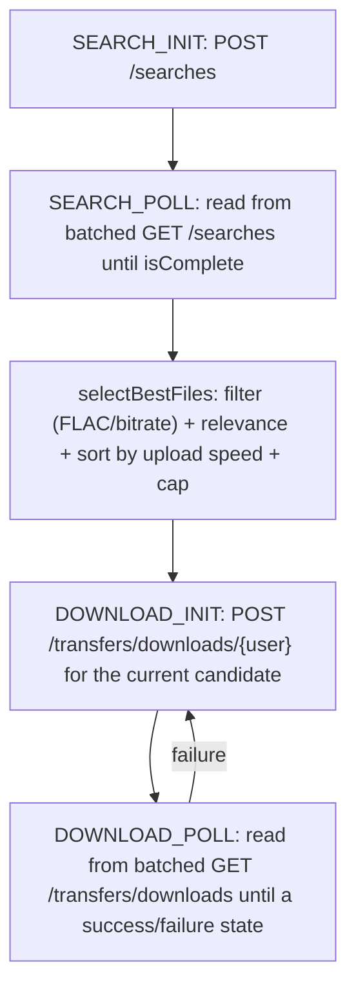

# slskd Integration

> Status: current as of 2026-08-13, branch `durable-download-state-machine`. Agent-oriented guide - the cited source files are the source of truth; verify before relying.

slskd is the Soulseek daemon Naviseerr uses to search the Soulseek network and download files. This subsystem searches, picks the best candidate files, enqueues a download, and drives it to completion with retry/failover. It is fully reactive (`Mono`/`Flux`), and — since the durable-download-state-machine work — driven by the pass loop in [download-manager.md](download-manager.md) rather than by an in-process poll-until-done chain.

## Flow at a glance

Both "poll until done" chains that used to live in this subsystem (`SlskdSearchResultProcessor.pollUntilComplete` and `SlskdDownloadProcessor.pollUntilComplete`) are gone. In their place, each is now four independent one-call steps, driven by [DownloadStateMachine](download-manager.md#the-four-phases) across passes of the loop:

A completed search's candidates are computed once (in `SEARCH_POLL`) and carried forward as JSON on the task row (`DownloadCandidate`, not the raw slskd DTOs), so `DOWNLOAD_INIT`/`DOWNLOAD_POLL` never need to re-fetch or re-rank them. On a transfer failure, the loop either retries the same candidate (up to `slskd-service.retry-count`) or advances to the next one — see `DownloadStateMachine.retryOrAdvanceCandidate` and the phase table in [download-manager.md](download-manager.md#the-four-phases).

## HTTP client

- [SlskdConfig.java](../../src/main/java/com/catacomb5099/naviseerr/services/slskd/SlskdConfig.java) builds the `slskdWebClient` bean: base URL `slskd-service.url`, default header `X-API-Key: slskd-service.api_key`.
- [SlskdService.java](../../src/main/java/com/catacomb5099/naviseerr/services/slskd/SlskdService.java) wraps the raw calls (all return `Mono`/`Flux`):
  - `searchResults(query)` -> `POST /searches` with body `{searchText, searchTimeout}` -> `SearchState` (carries the search `id`). Backs `SEARCH_INIT`.
  - `getAllSearches()` -> `GET /searches` -> `Flux<SearchState>`, every search slskd currently knows about, collected into a map by id once per pass. Backs the `isComplete` gate in `SEARCH_POLL`. **Summaries only:** this endpoint takes no `includeResponses` parameter and always returns `responses` empty, however many results the search really found — so it can say *whether* a search is done but never *what it found*.
  - `getSearchWithResponses(searchId)` -> `GET /searches/{id}?includeResponses=true` -> `SearchState` including `responses`. The only endpoint that populates them, so it is the required follow-up to `getAllSearches()` before candidate selection. Called once per download, on the transition to complete — not once per poll.
  - `enqueueDownload(username, file)` -> `POST /transfers/downloads/{username}` with a one-element file list -> `QueueDownloadResponse` (`enqueued`, `failed`). Backs `DOWNLOAD_INIT`.
  - `getAllDownloads()` -> `GET /transfers/downloads` -> `Flux<TransferedFile>`, every transfer slskd currently knows about, collected into a map by id once per pass. Backs `DOWNLOAD_POLL`. **The response is nested, not flat:** transfers are grouped by peer and then by directory (`UserTransfers` -> `TransferDirectory` -> `TransferedFile`), unlike `getDownloadProgress` which returns a bare transfer, so this method flattens two levels. Reading it flat yields one all-null transfer per peer and a lookup map keyed by `null`. `SlskdServiceTransfersShapeTest` pins the shape against live-captured JSON.
  - `getDownloadProgress(username, downloadId)` -> `GET /transfers/downloads/{username}/{downloadId}` -> `TransferedFile`. Kept, but not called by the default path — it is the documented fallback for `getAllDownloads()` (see "Accepted risk" below), not currently wired into `DownloadStepExecutor`.

`GET /searches` and `GET /transfers/downloads` are each fetched **once per pass**, and only when at least one row claimed in that pass actually needs one — see [download-manager.md](download-manager.md#batching-the-two-poll-phases) for the batching mechanics and why it turns "one call per download per poll" into "at most two calls per pass."

### Accepted risk: no filter on `GET /transfers/downloads`

Unlike `GET /searches`, `GET /transfers/downloads` has no pagination, date filter, or state filter — only `includeRemoved` — so its response size on an install with years of accumulated transfer history remains an open question (first flagged during Task 4 of the implementation plan). **Partially checked on 2026-08-19:** a live instance with one transfer returned 696 bytes, which confirms the endpoint's *shape* (see above) but says nothing about its size at history scale. slskd retains completed transfers — `removed: false` on a finished one — so growth is real; it just has not been measured.

What has changed since the original assessment: `DownloadTaskRunner` now filters the response down to the transfer ids of the rows claimed in the current pass before building the lookup map. That bounds *our memory and the map* by our own concurrency regardless of history, though not the response body itself, which is still transferred and parsed in full. If the body size does become a problem, the documented fallback is unchanged: per-transfer polling via `getDownloadProgress`, parallelised instead of read from a shared map — a same-shape swap limited to one branch in `DownloadStepExecutor` and one call site in `DownloadTaskRunner`.

## Search + candidate selection

[SlskdSearchResultProcessor.java](../../src/main/java/com/catacomb5099/naviseerr/services/slskd/SlskdSearchResultProcessor.java):

- `selectBestFiles(state, query)` builds the ordered candidate list `List<Map.Entry<SearchResponseItem, SearchFile>>` — unchanged by the state-machine rewrite, kept byte-for-byte as the guard that the pipeline work did not touch ranking. `query` is now a `TrackQuery`, not a bare string (song-metadata-table plan), and its log line prints `songName`/`artists` as separate fields rather than one interpolated `query='...'` string, specifically so a bad match can be diagnosed as "wrong song name" vs "artist metadata missing/wrong" without unpicking a combined string:
  1. flatten every `(response item, file)` pair from `state.getResponses()`,
  2. keep files that are FLAC or have bit rate `>= slskd-service.min-bit-rate`,
  3. keep files whose filename is relevant to the query via [TrackMatchingService](#track-matching),
  4. sort by availability first (`hasFreeUploadsSlot`, then `queueLength`, then `uploadSpeed` descending) — see `SlskdSearchResultProcessor.BY_AVAILABILITY`,
  5. cap to `slskd-service.max-files-per-download`.
- `DownloadStepExecutor` calls this only once a `SEARCH_POLL` sees `isComplete = true`, then converts the result to `DownloadCandidate` (see [download-manager.md](download-manager.md)) for storage on the task row.

### Query wording: `SlskdQueryBuilder`

Before the song-metadata-table plan, there was no single place that decided how a track's name and
artist became the string sent to Soulseek: `DownloadStepExecutor` passed the bare song name with no
artist at all, and (separately) `TrackMatchingService` guessed at an artist by splitting that same
bare string on a hyphen. Neither used real artist metadata, even once
[`TrackQuery`](../../src/main/java/com/catacomb5099/naviseerr/schema/request/TrackQuery.java) (name
plus a list of credited artists, carried on `DownloadTask.query()`) existed to supply it.

[SlskdQueryBuilder.java](../../src/main/java/com/catacomb5099/naviseerr/services/slskd/SlskdQueryBuilder.java)
is now the one place that question is answered: `build(TrackQuery)` returns primary artist, then song
name, space-joined, with punctuation stripped — e.g. `"Vance Joy Riptide"`. Soulseek matches tokens
against file paths, so the old hyphen was a token that matched nothing in a real filename. Joining
*every* credited artist was considered and rejected: a four-way collab is rarely filed under all four
names on Soulseek, so it narrows a search too hard. Primary-artist-only is therefore the default;
`slskd-service.query-builder.use-all-artists` is the escape hatch for a catalog or uploader convention
that does credit everyone. `DownloadStepExecutor`'s `SEARCH_INIT` step calls
`queryBuilder.build(task.query())` in place of the old bare `task.songName()`.

`TrackMatchingService` needs the identical wording to score a candidate filename against what was
actually searched for, but cannot call into `SlskdQueryBuilder` to get it — see "Track matching"
below for why, and for the resulting duplication.

### Track matching

[TrackMatchingService.java](../../src/main/java/com/catacomb5099/naviseerr/util/TrackMatchingService.java) uses fuzzywuzzy, and — since the song-metadata-table plan — real artist metadata rather than a guess. `isMatch(TrackQuery, filePath)` takes the same `TrackQuery` the query builder above consumes:

- **When `query.artists()` is non-empty** (the normal case as of this plan): it builds the same
  `"artist song"` composite `SlskdQueryBuilder.build` produces — its own copy, `buildFuzzyComposite`,
  mirroring the same `use-all-artists` toggle from the same property key — and returns true if any of:
  `tokenSortRatio >= 75`, `partialRatio >= 85`, or the normalized filename contains the normalized
  song name **and** the normalized name of *at least one* credited artist (`containsSongAndAnyArtist`
  — any, not all, for the same collab reason the query builder is primary-artist-only). The two
  classes can't share this logic: `SlskdQueryBuilder` lives in `services.slskd`, which already
  depends on `util` (home of `TrackMatchingService`, reached via `SlskdSearchResultProcessor`), so the
  reverse call would make that package dependency circular. Each class's comment cross-references the
  other and explains why; the toggle is mirrored by hand so a config change can't make the two
  wordings disagree only in the non-default configuration.
- **When `query.artists()` is empty** — the deprecated `POST /download/{songName}` route, or any row
  backfilled by `V5__song_metadata.sql` with no artist to carry over — matching falls through to
  `extractParts`'s pre-existing `"-"`-split heuristic, verbatim. This is now a **documented, deliberate
  degraded fallback**, not the primary matching strategy: splitting an arbitrary string on the first
  `-` and guessing which side is the artist is a guess, not a parse (a title containing its own hyphen,
  e.g. `"Twenty-One"`, is misparsed), and it stays only because those two call sites genuinely have no
  artist metadata to hand in instead.

`normalize(...)` (unchanged) strips extensions, track numbers, bracketed content, common metadata
terms, years, and non-alphanumerics, and is applied to both the composite/song-name side and the
filename side before comparison. See
[docs/decisions/song-metadata-table-31-08-2026.md](../decisions/song-metadata-table-31-08-2026.md) for
the full rationale behind the any-artist rule and the query-builder split, and
[gotchas.md](gotchas.md) for the fallback's status as an intentional, not accidental, degradation.

## Search state

[SlskdSearchState.java](../../src/main/java/com/catacomb5099/naviseerr/schema/slskd/SlskdSearchState.java) classifies slskd's search-state string, mirroring `TransferState`'s shape: `NONE`, `REQUESTED`, `IN_PROGRESS`, `COMPLETED`, `TIMED_OUT`, `RESPONSE_LIMIT_REACHED`, `FILE_LIMIT_REACHED`, and the two failure states `CANCELLED`/`ERRORED`. slskd reports compound states like `"Completed, TimedOut"`, so `parse(state)` comma-splits before matching, same as `TransferedFileUtil`. `isFailure(state)` is what `DownloadStateMachine.afterSearchPoll` checks before falling through to the completion/still-running branches.

**Note the asymmetry:** `TimedOut` is a *failure* for a transfer (`TransferState.TIMED_OUT.isFailure() == true`) but *normal completion* for a search — slskd finishes a search by running out its own timeout, and a timed-out search with usable candidates should proceed exactly like one that completed any other way. `SlskdSearchState.TIMED_OUT` is not in the failure set for this reason.

These values are unverified guesses at the real slskd API strings, not confirmed against a live instance — see the note in [gotchas.md](gotchas.md). The design is deliberately robust to getting them wrong: `isFailure` only returns `true` for a state it explicitly recognises as a failure, so an unrecognised or misspelled state string falls through to the "completed with no usable candidates" path (`NO_CANDIDATES`) rather than being silently treated as success.

## Transfer states

[TransferState.java](../../src/main/java/com/catacomb5099/naviseerr/schema/slskd/TransferState.java) enumerates slskd transfer states with `success`/`failure` flags:

- Success: `SUCCEEDED`.
- Failure: `CANCELLED`, `TIMED_OUT`, `ERRORED`, `REJECTED`, `ABORTED`.
- Everything else (`QUEUED`, `INITIALIZING`, `IN_PROGRESS`, `COMPLETED`, ...) is "in progress" -> keep polling.

slskd reports compound states like `"Completed, Succeeded"`, so the state string is comma-split before matching. [TransferedFileUtil.getStateList](../../src/main/java/com/catacomb5099/naviseerr/util/TransferedFileUtil.java) does this parsing, matching against `TransferState.getValue()` (the slskd string, e.g. `"InProgress"`, `"TimedOut"`) — not the enum `name()`. `DownloadStateMachine.afterDownloadPoll` treats any success state as `Terminal SUCCEEDED` and any failure state as a retry/next-candidate decision.

## naviseerr owns candidate-level retry, deliberately

slskd 0.26.0 added its own per-file retry with real exponential backoff and partial-file resume (`transfers.download.retry.*`, in slskd's own config), which overlaps with `slskd-service.retry-count`. naviseerr keeps both of its retry tiers (same-peer retry, then next-candidate failover) rather than delegating the same-peer tier to slskd, because splitting the concern would mean naviseerr can no longer fully explain its own retry behaviour, and slskd has no visibility into the ranked candidate list so it could only ever take on one of the two tiers anyway. See [docs/decisions/durable-download-state-machine-13-08-2026.md](../decisions/durable-download-state-machine-13-08-2026.md) ("naviseerr keeps candidate-level retry; does not hand any of it to slskd") for the full rationale, including the unresolved compounding-retry risk this leaves and the operational mitigation (pin `transfers.download.retry.attempts` to `0`/`1` on the slskd side).

## Configuration knobs (`slskd-service.*` in application.yaml)

- `url`, `api_key` - client config.
- `timeout` - search timeout sent to slskd.
- `min-bit-rate` (320) - candidate bitrate filter.
- `max-files-per-download` (10) - candidate list cap.
- `retry-count` (2) - per-candidate failover retries, consumed by `DownloadStateMachine`, not by an in-process poller.

Per-phase poll intervals and duration budgets (`search-poll-interval-ms`, `download-poll-interval-ms`, `search-budget-ms`, `download-budget-ms`) now live under `download-task.*` — see [download-manager.md](download-manager.md#configuration-download-task-in-applicationyaml). The old `slskd-service.max-poll-attempts` and `slskd-service.first-back-off-duration-ms` knobs are gone (removed in Task 6, along with the poller they configured), not merely unused.

## Related docs

- Reactive patterns (the pass loop, row-level concurrency): [reactive-patterns.md](reactive-patterns.md)
- How downloads are driven end-to-end: [download-manager.md](download-manager.md)
- ADR (`SlskdQueryBuilder`, the any-artist matching rule, the `extractParts` fallback): [docs/decisions/song-metadata-table-31-08-2026.md](../decisions/song-metadata-table-31-08-2026.md)
- Known issues: [gotchas.md](gotchas.md)
