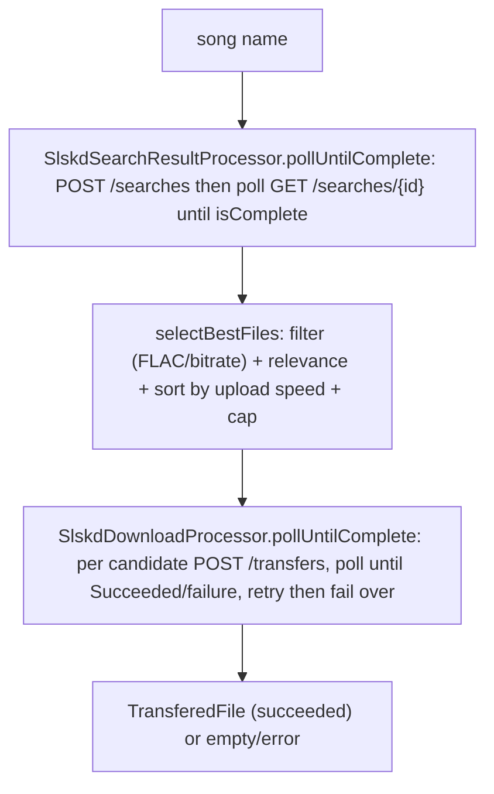

# slskd Integration

> Status: current as of 2026-06-29, branch `event-driven-download-queue`. Agent-oriented guide - the cited source files are the source of truth; verify before relying.

slskd is the Soulseek daemon Naviseerr uses to search the Soulseek network and download files. This subsystem searches, picks the best candidate files, enqueues a download, and polls it to completion with retry/failover. It is fully reactive (`Mono`).

## Flow at a glance

## HTTP client

- [SlskdConfig.java](../../src/main/java/com/catacomb5099/naviseerr/services/slskd/SlskdConfig.java) builds the `slskdWebClient` bean: base URL `slskd-service.url`, default header `X-API-Key: slskd-service.api_key`.
- [SlskdService.java](../../src/main/java/com/catacomb5099/naviseerr/services/slskd/SlskdService.java) wraps the raw calls (all return `Mono`):
  - `searchResults(query)` -> `POST /searches` with body `{searchText, searchTimeout}` -> `SearchState` (carries the search `id`).
  - `getSearchResultsProgress(searchId)` -> `GET /searches/{id}?includeResponses=true` -> `SearchState` (`isComplete`, `fileCount`, `responses`).
  - `enqueueDownload(username, file)` -> `POST /transfers/downloads/{username}` with a one-element file list -> `QueueDownloadResponse` (`enqueued`, `failed`).
  - `getDownloadProgress(username, downloadId)` -> `GET /transfers/downloads/{username}/{downloadId}` -> `TransferedFile`.

## Search + candidate selection

[SlskdSearchResultProcessor.java](../../src/main/java/com/catacomb5099/naviseerr/services/slskd/SlskdSearchResultProcessor.java):

- `pollUntilComplete(query)`:
  - Empty query short-circuits to `Mono.empty()`.
  - Fires `searchResults`, then polls `getSearchResultsProgress(id)` until done.
  - `done = SearchState::getIsComplete`; `failed` is always `false` (search never "fails" in this loop - it only completes or exhausts poll attempts); `individualFailRetries = 0` (no candidate failover for search).
  - Uses [ReactivePoller](reactive-patterns.md) with `defaultBackoff(firstBackOffDuration, maxPollAttempts)`.
- `selectBestFiles(state, query)` builds the ordered candidate list `List<Map.Entry<SearchResponseItem, SearchFile>>`:
  1. flatten every `(response item, file)` pair from `state.getResponses()`,
  2. keep files that are FLAC or have bit rate `>= slskd-service.min-bit-rate`,
  3. keep files whose filename is relevant to the query via [TrackMatchingService](#track-matching),
  4. sort by uploader `uploadSpeed` descending,
  5. cap to `slskd-service.max-files-per-download`.

### Track matching

[TrackMatchingService.java](../../src/main/java/com/catacomb5099/naviseerr/util/TrackMatchingService.java) uses fuzzywuzzy. `isMatch(cleanTitle, filePath)` returns true if any of: `tokenSortRatio >= 75`, `partialRatio >= 85`, or both extracted artist and title substrings appear in the normalized filename. `normalize(...)` strips extensions, track numbers, bracketed content, common metadata terms, years, and non-alphanumerics. `extractParts(...)` assumes an `"-"` separator between artist and title (noted TODO) - see [gotchas.md](gotchas.md).

## Download + polling + retry

[SlskdDownloadProcessor.java](../../src/main/java/com/catacomb5099/naviseerr/services/slskd/SlskdDownloadProcessor.java) `pollUntilComplete(files)`:

- Empty candidate list short-circuits to `Mono.empty()`.
- Builds one enqueue `Supplier` per candidate (the whole ordered list).
- `done` = the file's parsed states contain any `TransferState` with `isSuccess`; `failed` = any with `isFailure`.
- For each enqueued candidate it polls `getDownloadProgress(username, id)` (the id comes from `queueDownloadResponse.getEnqueued().getFirst()`).
- `individualFailRetries = slskd-service.retry-count`, enabling per-candidate retries before failing over to the next candidate. The retry/failover mechanics live in [ReactivePoller](reactive-patterns.md).

Important terminal behavior: a candidate can end as `Mono.error(PollingFailedException)` (a failure state) OR, when all candidates are exhausted, the whole thing can resolve to `Mono.empty()`. Callers must treat BOTH as "did not succeed" (the download worker does - see [download-manager.md](download-manager.md)).

## Transfer states

[TransferState.java](../../src/main/java/com/catacomb5099/naviseerr/schema/slskd/TransferState.java) enumerates slskd transfer states with `success`/`failure` flags:

- Success: `SUCCEEDED`.
- Failure: `CANCELLED`, `TIMED_OUT`, `ERRORED`, `REJECTED`, `ABORTED`.
- Everything else (`QUEUED`, `INITIALIZING`, `IN_PROGRESS`, `COMPLETED`, ...) is "in progress" -> keep polling.

slskd reports compound states like `"Completed, Succeeded"`, so the state string is comma-split before matching. [TransferedFileUtil.getStateList](../../src/main/java/com/catacomb5099/naviseerr/util/TransferedFileUtil.java) does this parsing.

> Known bug: `getStateList` matches against the enum `name()` (e.g. `IN_PROGRESS`, `TIMED_OUT`) instead of the slskd `value` (`"InProgress"`, `"TimedOut"`). Single-word states match, but `InProgress` and `TimedOut` never do - so a timed-out download is not detected as a failure and keeps polling until `max-poll-attempts` is exhausted. See [gotchas.md](gotchas.md).

## Configuration knobs (`slskd-service.*` in application.yaml)

- `url`, `api_key` - client config.
- `timeout` - search timeout sent to slskd.
- `min-bit-rate` (320) - candidate bitrate filter.
- `max-files-per-download` (10) - candidate list cap.
- `retry-count` (2) - per-candidate failover retries.
- `max-poll-attempts` (30) - poll backoff attempts.
- `first-back-off-duration-ms` (50) - poll backoff base.

## Related docs

- Reactive retry/poll engine: [reactive-patterns.md](reactive-patterns.md)
- How downloads are driven end-to-end: [download-manager.md](download-manager.md)
- Known issues: [gotchas.md](gotchas.md)
